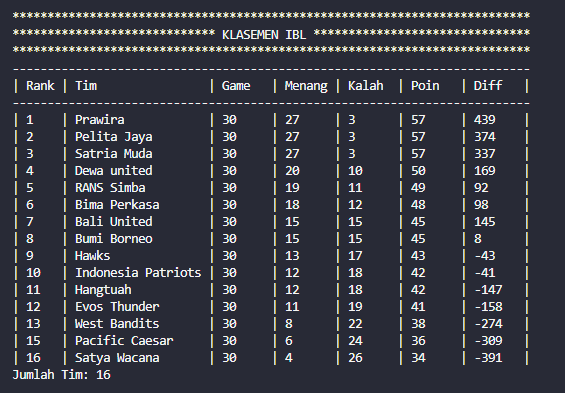

# Laporan Kuis 2 - Liga Bola Basket Indonesia - Double Linked List
#### Nama : Alvanza Saputra Yudha
#### Kelas : 1-H
#### NIM : 2341720182

<hr>

##  Penjelasan Klasemen Liga Bola Basket Indonesia

- Rank dari klub ditentukan oleh point
- Satu win mendapatkan 2 point
- Satu kalah mendapatkan 1 point
- Jika point sama, maka urutan rank ditentukan berdasarkan goal difference

##  Kode Program

- Class Klub
    ```java
    public class Klub {
        String nama;
        int win, lose, diff;
        int point, match;

        Klub(String nama, int win, int lose, int diff) {
            this.nama = nama;
            this.win = win;
            this.lose = lose;
            this.diff = diff;
            this.point = (win * 2) + lose;
            this.match = win + lose;
        }
    }
    ```

- Class Node
    ```java
    public class Node {
        Klub data;
        Node next, prev;

        Node(Node prev, Klub data, Node next) {
            this.prev = prev;
            this.data = data;
            this.next = next;
        }
    }
    ```

- Class DLL
    ```java
    public class DLL {
        Node head;
        int size;

        DLL() {
            head = null;
            size = 0;
        }

        public boolean isEmpty() {
            return head == null;
        }

        public void add(Klub item) {
            if(isEmpty()) {
                head = new Node(null, item, null);
                size++;
            } else {
                Node current = head;
                while(current.next != null) {
                    current = current.next;
                }
                Node newNode = new Node(current, item, null);
                current.next = newNode;
                size++;
            }
        }

        public void remove(int index) throws Exception {
            if (isEmpty() || index > size) {
                throw new Exception("Nilai indeks di luar batas");
            } else if (index == 1) {
                head = head.next;
                head.prev = null;
                size--;
            } else {
                Node current = head;
                int i = 1;
                while(i < index) {
                    current = current.next;
                    i++;
                }
                System.out.println(current.data.nama + " pada rank ke-" + index + " telah dihapus.\n");
                if (current.next == null) {
                    current.prev.next = null;
                } else if (current.prev == null) {
                    current = current.next;
                    current.prev = null;
                    head = current;
                } else {
                    current.prev.next = current.next;
                    current.next.prev = current.prev;
                }
                size--;
            }
        }

        public void print() {
            if(isEmpty()) {
                System.out.println("Linked lists kosong");
            } else {
                Node tmp = head;
                int i = 1;
                System.out.println("**************************************************************************");
                System.out.println("***************************** KLASEMEN IBL *******************************");
                System.out.println("**************************************************************************");
                System.out.println("--------------------------------------------------------------------------");
                System.out.printf("| %-4s | %-18s | %-6s | %-6s | %-6s | %-6s | %-6s |\n", "Rank", "Tim", "Game", "Menang", "Kalah", "Poin", "Diff");
                System.out.println("--------------------------------------------------------------------------");
                while(tmp != null) {
                    System.out.printf("| %-4s | %-18s | %-6s | %-6s | %-6s | %-6s | %-6s |\n", i, tmp.data.nama, tmp.data.match, tmp.data.win, tmp.data.lose, tmp.data.point, tmp.data.diff);
                    tmp = tmp.next;
                    i++;
                }
                System.out.println("--------------------------------------------------------------------------");
                System.out.println("Jumlah Tim: " + (i-1) + "\n");
            }
        }

        public void sorting() {
            Node current;
            Node index;
            Klub temp;

            if (!isEmpty()) {
                current = head;
                while (current != null) {
                    index = current.next;
                    while (index != null) {
                        if (current.data.point < index.data.point) {
                            temp = current.data;
                            current.data = index.data;
                            index.data = temp;
                        } else if(current.data.point == index.data.point){
                            if (current.data.diff < index.data.diff) {
                                temp = current.data;
                                current.data = index.data;
                                index.data = temp;
                            }
                        }
                        index = index.next;
                    }
                    current = current.next;
                }
            } else {
                System.out.println("Linked list masih kosong, tidak dapat mengurutkan data!");
            }
        }

        public void searchRank(String nama) {
            int posisi = -1;
            Node current = head;
            int i = 1;
            while(current != null) {
                if(current.data.nama.equalsIgnoreCase(nama)) {
                    posisi = i;
                    break;
                }
                current = current.next;
                i++;
            }

            if (posisi != -1) {
                System.out.println("Data Ditemukan!!");
                
                System.out.println("--------------------------------------------------------------------------");
                System.out.printf("| %-4s | %-18s | %-6s | %-6s | %-6s | %-6s | %-6s |\n", "Rank", "Tim", "Game", "Menang", "Kalah", "Poin", "Diff");
                System.out.println("--------------------------------------------------------------------------");
                System.out.printf("| %-4s | %-18s | %-6s | %-6s | %-6s | %-6s | %-6s |\n", posisi, current.data.nama, current.data.match, current.data.win, current.data.lose, current.data.point, current.data.diff);
                System.out.println("--------------------------------------------------------------------------\n");

            } else {
                System.out.println("Data Klub Tidak Ditemukan!!\n");
            }
        }
        
        public void searchName(int rank) {
            int posisi = -1;
            Node current = head;
            int i = 1;
            while(current != null) {
                if(i == rank) {
                    posisi = i;
                    break;
                }
                current = current.next;
                i++;
            }

            if (posisi != -1) {
                System.out.println("Data Ditemukan!!");
                
                System.out.println("--------------------------------------------------------------------------");
                System.out.printf("| %-4s | %-18s | %-6s | %-6s | %-6s | %-6s | %-6s |\n", "Rank", "Tim", "Game", "Menang", "Kalah", "Poin", "Diff");
                System.out.println("--------------------------------------------------------------------------");
                System.out.printf("| %-4s | %-18s | %-6s | %-6s | %-6s | %-6s | %-6s |\n", posisi, current.data.nama, current.data.match, current.data.win, current.data.lose, current.data.point, current.data.diff);
                System.out.println("--------------------------------------------------------------------------\n");

            } else {
                System.out.println("Data Klub Tidak Ditemukan!!\n");
            }
        }
    }
    ```

- Class Main
    ```java
    import java.util.*;

    public class Main {
        public static int menu() {
            Scanner sc = new Scanner(System.in);
            System.out.println("+------------------------------+");
            System.out.println("|------------ MENU ------------|");
            System.out.println("|------------------------------|");
            System.out.println("| 1. Tampilkan Klasemen        |");
            System.out.println("| 2. Tambah Data Klub IBL      |");
            System.out.println("| 3. Hapus Data Klub IBL       |");
            System.out.println("| 4. Pencarian Data Klub       |");
            System.out.println("| 0. Keluar                    |");
            System.out.println("+------------------------------+");
            System.out.print("Masukkan pilihan anda: ");
            int menu = sc.nextInt();
            return menu;
        }

        public static Klub inputKlub() {
            System.out.println("*********************");
            System.out.println("** INPUT DATA KLUB **");
            System.out.println("*********************");
            Scanner sc = new Scanner(System.in);
            System.out.print("Masukkan nama klub: ");
            String nama = sc.nextLine();
            System.out.print("Masukkan jumlah menang: ");
            int menang = sc.nextInt();
            System.out.print("Masukkan jumlah kalah: ");
            int kalah = sc.nextInt();
            System.out.print("Masukkan poin difference: ");
            int diff = sc.nextInt();
            System.out.println();
            return new Klub(nama, menang, kalah, diff);
        }

        public static int removeKlub() {
            Scanner sc = new Scanner(System.in);
            System.out.println("*********************");
            System.out.println("** HAPUS DATA KLUB **");
            System.out.println("*********************");
            System.out.print("Masukkan rank klub: ");
            int rank = sc.nextInt();
            return rank;
        }

        public static int searchName() {
            Scanner sc = new Scanner(System.in);
            System.out.print("Masukkan rank klub: ");
            int rank = sc.nextInt();
            System.out.println();
            return rank;
        }

        public static String searchRank() {
            Scanner sc = new Scanner(System.in);
            System.out.print("Masukkan nama klub [nama harus sama]: ");
            String rank = sc.nextLine();
            System.out.println();
            return rank;
        }

        public static void main(String[] args) throws Exception {
            Scanner sc = new Scanner(System.in);
            System.out.println("********************************");
            System.out.println("** Liga Bola Basket Indonesia **");
            System.out.println("********************************\n");
            DLL dll = new DLL();
            
            // add data klasemen
            dll.add(new Klub("Prawira", 27, 3, 439));
            dll.add(new Klub("Satria Muda", 27, 3, 337));
            dll.add(new Klub("Pelita Jaya", 27, 3, 374));
            dll.add(new Klub("Dewa united", 20, 10, 169));
            dll.add(new Klub("RANS Simba", 19, 11, 92));
            dll.add(new Klub("Bima Perkasa", 18, 12, 98));
            dll.add(new Klub("Bali United", 15, 15, 145));
            dll.add(new Klub("Bumi Borneo", 15, 15, 8));
            dll.add(new Klub("Hawks", 13, 17, -43));
            dll.add(new Klub("Indonesia Patriots", 12, 18, -41));
            dll.add(new Klub("Hangtuah", 12, 18, -147));
            dll.add(new Klub("Evos Thunder", 11, 19, -158));
            dll.add(new Klub("West Bandits", 8, 22, -274));
            dll.add(new Klub("NSH Mountain", 6, 24, -299));
            dll.add(new Klub("Pacific Caesar", 6, 24, -309));
            dll.add(new Klub("Satya Wacana", 4, 26, -391));

            while(true) {
                dll.sorting();
                int menu = menu();
                System.out.println();
                switch (menu) {
                    case 1:
                        dll.print();
                        break;

                    case 2:
                        dll.add(inputKlub());
                        break;

                    case 3:
                        dll.remove(removeKlub());
                        break;
                        
                    case 4:
                        System.out.println("+-------------------------------+");
                        System.out.println("|---------Menu Pencarian--------|");
                        System.out.println("|-------------------------------|");
                        System.out.println("| 1. Pencarian berdasarkan rank |");
                        System.out.println("| 2. Pencarian berdasarkan nama |");
                        System.out.println("+-------------------------------+");
                        System.out.print("Masukkan pilihan anda: ");
                        int searchMenu = sc.nextInt();
                        switch (searchMenu) {
                            case 1:
                                dll.searchName(searchName());
                                break;

                            case 2:
                                dll.searchRank(searchRank());
                                break;
                        
                            default:
                                System.out.println("Pilihan yang anda masukkan salah!");
                                break;
                        }
                        break;

                    case 0:
                        System.exit(0);
                        break;
                
                    default:
                        System.out.println("Inputan salah!, Coba Lagi!!");
                        break;         
                }
            }
        }
    }
    ```

##  Output Program

- Tampilan menu
 
     

- Tampilan klasemen

     

- Tampilan menambah data klub di klasemen

     

     

- Tampilan pencarian data klub (berdasarkan rank)

     

- Tampilan pencarian data klub (berdasarkan nama klub)

     

- Tampilan menghapus data klub di klasemen

     

     