# Laporan Jobsheet 1
#### Nama : Alvanza Saputra Yudha
#### Kelas : 1-H
#### NIM : 2341720182

*  ### Praktikum Pemilihan

    Output Program : 

    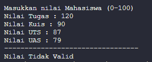

    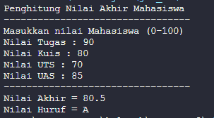

    Program meminta user menginput nilai tugas, kuis, UTS, dan UAS yang nilainya antara 0-100. jika tidak diantara itu maka program akan Mengeluarkan output "Nilai Tidak Valid". Jika nilainya valid, program akan menghitung nilai-nilai tersebut dengan ketentuan 20% nilai tugas, 20% dari nilai kuis, 30% nilai UTS, dan 30% nilai UAS.

* ### Praktikum Perulangan

    Output Program : 

    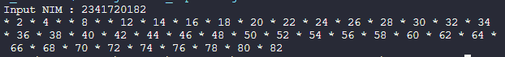

    Program meminta user menginput NIM, lalu 2 angka dibelakang nim akan menjadi nilai n yang dimana program akan menampilkan bilangan deret 1 - n kecuali angka 6 dan 10, dan nilai ganji yang akan dicetak dengan "*".

* ### Praktikum Array

    Output Program : 

    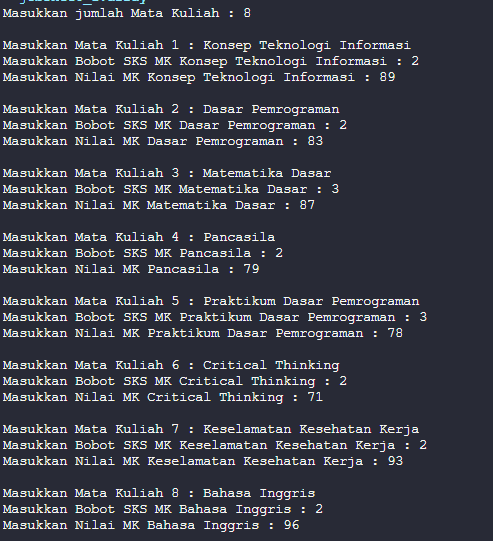

    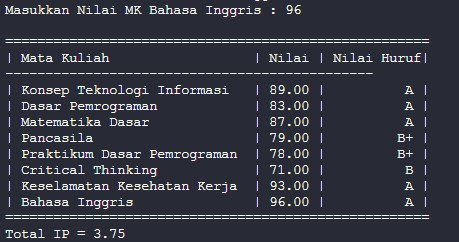

    Pertama program akan meminta input jumlah dari mata kuliah, selanjutnya user harus menginput nama matakuliah, bobot SKS, serta nilai angka dari matakuliah tersebut yang selanjutnya akan dikonversi secara otomatis menjadi nilai huruf. Setelah dihitung program akan mengeluarkan rekap nilai beserta dengan total IP dari mahasiswa.

* ### Praktikum Fungsi

    Output Program : 

    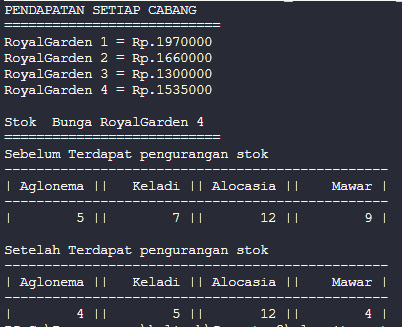

    Program akan mengeluarkan output pendapatan dari setiap cabang dari toko bunga yang berada pada fungsi pendapatan. lalu pada fungsi stokCab4, program akan mengeluarkan output berupa stok bunga yang tersedia pada cabang 4 sebelum dan sesudah terjadi pengurangan stok.

* ### Tugas

    #### Tugas 1 

    Output Program : 

    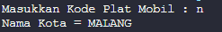
    
    Jika kode plat ditemukan.

    

    Jika kode plat tidak ditemukan.

    #### Tugas 2

    Output  Program : 

    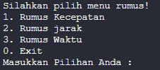

    Output fungsi menu.

    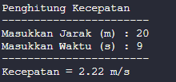
    
    Output fungsi kecepatan.

    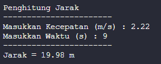
    
    Output fungsi jarak.

    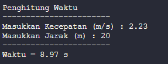
    
    Output fungsi waktu.

