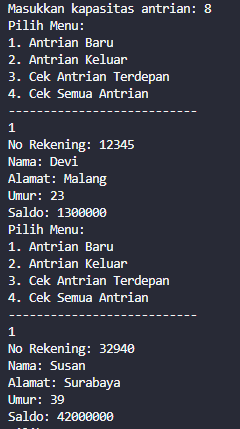

# Laporan Jobsheet 10
#### Nama : Alvanza Saputra Yudha
#### Kelas : 1-H
#### NIM : 2341720182

<hr>

# Praktikum 

* ## 10.2 Praktikum 1

    Verifikasi Hasil Percobaan

    Enqueue dan Peek data Queue :

    

    ### 10.2.3 Pertanyaan
1. Pada konstruktor, mengapa nilai awal atribut front dan rear bernilai -1, sementara atribut size bernilai 0?
    - front dan rear bernilai -1 supaya tidak menunjuk pada index array apapun(kosong), dan size bernilai 0 karena saat inisialisasi arraynya masih kosong

2. Pada method Enqueue, jelaskan maksud dan kegunaan dari potongan kode berikut!

    

    - Kegunaannya adalah ketika data paling belakang dari queue berada di indeks terakhir array lalu dimasukkan data baru, maka data tersebut akan menempati posisi indeks ke 0

3. Pada method Dequeue, jelaskan maksud dan kegunaan dari potongan kode berikut!

    
    
    - Kegunaannya adalah ketika data paling depan dari queue berada di indeks terakhir array lalu dilakukan proses dequeue, maka data yang terambil adalah data pada index terakhir dan front akan bergesar pada index ke-0


4. Pada method print, mengapa pada proses perulangan variabel i tidak dimulai dari 0 (int i=0), melainkan int i=front?
    - Karena posisi front tidak selalu berada pada index 0, index dari front selalu berubah-ubah jika dilakukan pengambilan data

5. Perhatikan kembali method print, jelaskan maksud dari potongan kode berikut!

    

    - Kode tersebut digunakan untuk kembali ke awal queue ketika mencapai akhir. operasi ini akan mengembalikan i kembali ke awal antrian dengan cara menghitung sisa pembagian (modulo) i + 1 dengan max

6. Tunjukkan potongan kode program yang merupakan queue overflow!
    - Queue overflow merupakan kondisi dimana isi dari Queue sudah penuh/full
    ```java
        if (isFull()) {
            System.out.println("Queue sudah penuh");
        }
    ```

7. Pada saat terjadi queue overflow dan queue underflow, program tersebut tetap dapat berjalan dan hanya menampilkan teks informasi. Lakukan modifikasi program sehingga pada saat terjadi queue overflow dan queue underflow, program dihentikan!
    - Menambah varable isOverflow dan isUnderflow pada kondisi Queue overflow dan Queue underflow
    ```java
        if (isFull()) {
            System.out.println("Queue sudah penuh");
            isOverflow = true;
        }
        ...
        if(isEmpty()) {
            System.out.println("Queue masih kosong");
            isUnderflow = true;
        }
    ```
    - Menghentikan program jika isOverflow == true || isUnderflow == true
    ```java
        if (Q.isOverflow == true || Q.isUnderflow == true) {
            break;
        }
    ```
    - Output
        - Queue Underflow
            
        
        - Queue Overflow
            

* ## 10.3 Praktikum 2

    Verifikasi Hasil Percobaan

    - Input data nasabah: 

    

    - Cek semua antrian: 

    

    ### 10.3.3 Pertanyaan
1. Pada class QueueMain, jelaskan fungsi IF pada potongan kode program berikut!
    
    - Kode tersebut memeriksa data norek, nama, dan alamat tidak kosong (!"") dan data umur dan saldo tidak sama dengan 0. jika kondisi tersebut terpenuhi maka output akan mengeluarkan data antrian yang keluar dari Queue

2. Lakukan modifikasi program dengan menambahkan method baru bernama peekRear pada class Queue yang digunakan untuk mengecek antrian yang berada di posisi belakang! Tambahkan pula daftar menu 5. Cek Antrian paling belakang pada class QueueMain sehingga method peekRear dapat dipanggil!
    - Method peekRear
    ```java
    public void peekRear() {
        if(!isEmpty()) {
            System.out.println("Antrian paling belakang: " + data[rear].norek + " " + data[rear].nama + " " + data[rear].alamat + " " + data[rear].umur + " " + data[rear].saldo);
        } else {
            System.out.println("Antrian masih kosong!");
        }
    }
    ```

    - Tambahan daftar menu 5
    ```java
        case 5:
            antri.peekRear();
        break;
    ```

    - Output

        - Cek semua antrian

        

        - Cek antrian terdepan

        

        - Cek antrian paling belakang

        

* ## 10.4 Tugas

1. Buatlah program antrian untuk mengilustasikan pesanan disebuah warung. Ketika seorang pembeli akan mengantri, maka dia harus mendaftarkan nama, dan nomor HP seperti yang digambarkan pada Class diagram berikut:

    

    Class diagram Queue digambarkan sebagai berikut:

    

    Keterangan:

    • Method create(), isEmpty(), isFull(), enqueue(), dequeue() dan print(), kegunaannya sama seperti
    yang telah dibuat pada Praktikum

    • Method peek(): digunakan untuk menampilkan data Pembeli yang berada di posisi antrian paling
    depan

    • Method peekRear(): digunakan untuk menampilkan data Pembeli yang berada di posisi antrian
    paling belakang

    • Method peekPosition(): digunakan untuk menampilkan seorang pembeli (berdasarkan nama)
    posisi antrian ke berapa

    • Method daftarPembeli(): digunakan untuk menampilkan data seluruh pembeli 

    Jawab :

    - Output Tampilan Menu

    

    - Input Antrian Baru

    

    - Mengeluarkan Antrian

    

    - Cek Semua Antrian

    

    - Cek Antrian Terdepan

    

    - Cek Antrian Paling Belakang

    

    - Cek Posisi Antrian Dengan Nama

    

    - Mengosongkan Semua Antrian

    

    