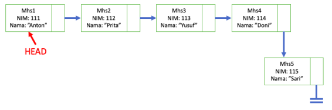
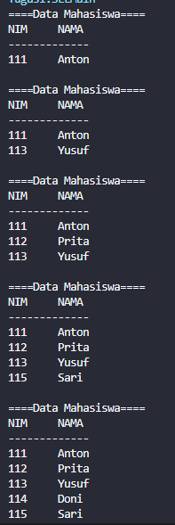
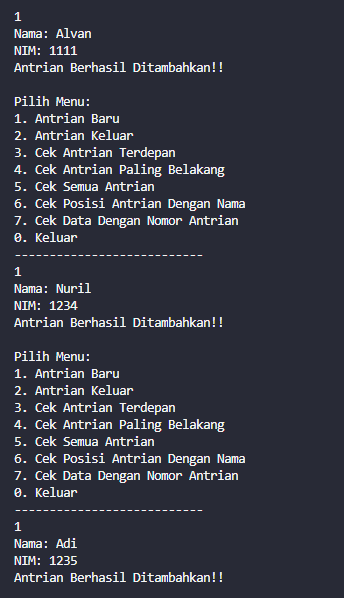
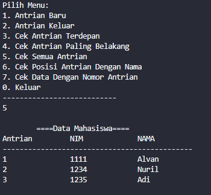
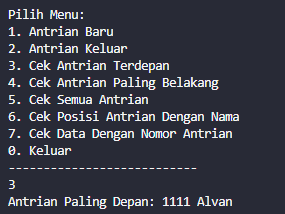
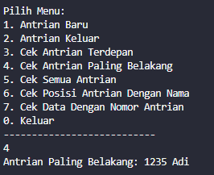
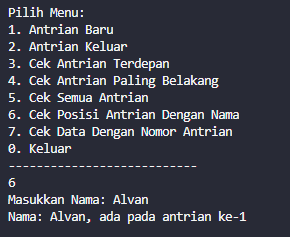
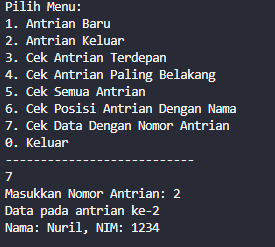
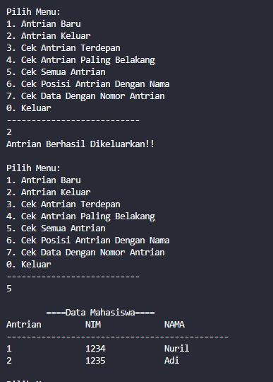

# Laporan Jobsheet 9
#### Nama : Alvanza Saputra Yudha
#### Kelas : 1-H
#### NIM : 2341720182

<hr>

# Praktikum 

* ## 2.1 Pembuatan Single Linked List

    Verifikasi Hasil Percobaan

    

    Hasil percobaan jika index pada insertAt() -1 :

    

    ### 2.1.2 Pertanyaan
1. Mengapa hasil compile kode program di baris pertama menghasilkan “Linked List Kosong”?
    - Karena pada baris pertama belum memasukkan nilai apa-apa.

2. Jelaskan kegunaan variable temp secara umum pada setiap method!
    - Digunakan untuk menyimpan data sementara sebelum dipindahkan

3. Perhatikan class SingleLinkedList, pada method insertAt Jelaskan kegunaan kode berikut 

    

    - Digunakan untuk memeriksa apakah node berikutnya setelah node saat ini adalah node terakhir dalam linked list nya. jika ya, maka tail akan menjadi node saat ini (temp.next).

* ## 2.2 Modifikasi Elemen pada Single Linked List

    Verifikasi Hasil Percobaan

    

    ### 2.1.2 Pertanyaan
1. Mengapa digunakan keyword break pada fungsi remove? Jelaskan!
    - Break digunakan untuk keluar dari looping setelah node dengan kunci yang cocok ditemukan dan dihapus. Jika tidak menggunakan break iterasi akan terus dilanjutkan meskipun node yang diinginkan sudah dihapus.
    
2. Jelaskan kegunaan kode dibawah pada method remove

    

    - Kode berikut digunakan untuk memeriksa apakah data elemen selanjutnya dalam linked list sama dengan parameter key. Jika ditemukan, maka elemen selanjutnya dihapus dari node.

* ## 3. Tugas

1. Implementasikan ilustrasi Linked List Berikut. Gunakan 4 macam penambahan data yang telah dipelajari sebelumnya untuk menginputkan data. 

    

    - Class Main

    ```java
    public class SLLMain {
        public static void main(String[] args) {
            SingleLinkedList singLL = new SingleLinkedList();

            Mahasiswa mhs1 = new Mahasiswa("Anton", 111);
            Mahasiswa mhs2 = new Mahasiswa("Prita", 112);
            Mahasiswa mhs3 = new Mahasiswa("Yusuf", 113);
            Mahasiswa mhs4 = new Mahasiswa("Doni", 114);
            Mahasiswa mhs5 = new Mahasiswa("Sari", 115);

            singLL.addFirst(mhs1);
            singLL.print();
            singLL.addLast(mhs3);
            singLL.print();
            singLL.insertAt(1, mhs2);
            singLL.print();
            singLL.addLast(mhs5);
            singLL.print();
            singLL.insertAfter(113, mhs4);
            singLL.print();

        }
    }
    ```

    - Output 

    


2. Buatlah implementasi program antrian layanan unit kemahasiswaan sesuai dengan kondisi yang ditunjukkan pada soal nomor 1! Ketentuan

    a. Implementasi antrian menggunakan Queue berbasis Linked List!

    b. Program merupakan proyek baru, bukan modifikasi dari soal nomor 1!

    - Input 3 Data Antrian

        

    - Cek Semua Antrian

        

    - Cek Antrian Terdepan

        

    - Cek Antrian Paling Belakang

        
    
    - Cek Nomor Antrian Dengan Nama

        
    
    - Cek Data Dengan Nomor Antrian

        

    - Remove Antrian (dequeue)
    
        