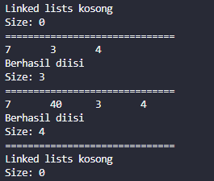
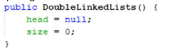
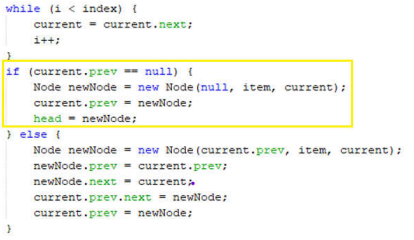
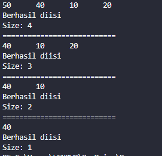
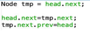
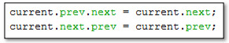

# Laporan Jobsheet 10 - Double Linked List
#### Nama : Alvanza Saputra Yudha
#### Kelas : 1-H
#### NIM : 2341720182

<hr>

# Praktikum 

* ## 12.2 Kegiatan Praktikum 1

    - Class Node
    ```java
    public class Node {
        int data;
        Node next, prev;

        Node(Node prev, int data, Node next) {
            this.data = data;
            this.next = next;
            this.prev = prev;
        }
    }
    ```

    - Class DoubleLinkedLists
    ```java
    public class DoubleLinkedLists {
        Node head;
        int size;

        DoubleLinkedLists() {
            head = null;
            size = 0;
        }

        public boolean isEmpty() {
            return head == null;
        }

        public void addFirst(int item) {
            if(isEmpty()) {
                head = new Node(null, item, null);
            } else {
                Node newNode = new Node(null, item, head);
                head.prev = newNode;
                head = newNode;
            }
            size++;
        }

        public void addLast(int item) {
            if(isEmpty()) {
                addFirst(item);
            } else {
                Node current = head;
                while(current.next != null) {
                    current = current.next;
                }
                Node newNode = new Node(current, item, null);
                current.next = newNode;
                size++;
            }
        }

        public void add(int item, int index) throws Exception {
            if(isEmpty()) {
                addFirst(item);
            } else if (index < 0 || index > size) {
                throw new Exception("Nilai indeks di luar batas");
            } else {
                Node current = head;
                int i = 0;
                while(i < index) {
                    current = current.next;
                    i++;
                }
                if (current.prev == null) {
                    Node newNode = new Node(null, item, current);
                    current.prev = newNode;
                    head = newNode;
                } else {
                    Node newNode = new Node(current.prev, item, current);
                    current.prev.next = newNode;
                    current.prev = newNode;
                }
            }
            size++;
        }

        public int size() {
            return size;
        }

        public void clear() {
            head = null;
            size = 0;
        }

        public void print() {
            if(isEmpty()) {
                System.out.println("Linked lists kosong");
            } else {
                Node tmp = head;
                while(tmp != null) {
                    System.out.print(tmp.data + "\t");
                    tmp = tmp.next;
                }
                System.out.println("\nBerhasil diisi");
            }
        }
    }
    ```

    - Class DoubleLinkedListsMain
    ```java
    public class DoubleLinkedListsMain {
        public static void main(String[] args) throws Exception {
            DoubleLinkedLists dll = new DoubleLinkedLists();

            dll.print();
            System.out.println("Size: " + dll.size());
            System.out.println("==============================");
            dll.addFirst(3);
            dll.addLast(4);
            dll.addFirst(7);
            dll.print();
            System.out.println("Size: " + dll.size());
            System.out.println("==============================");
            dll.add(40, 1);
            dll.print();
            System.out.println("Size: " + dll.size());
            System.out.println("==============================");
            dll.clear();
            dll.print();
            System.out.println("Size: " + dll.size());

        }
    }
    ```

    - Verifikasi Hasil Percobaan

    

    ### 12.2.3 Pertanyaan
1. Jelaskan perbedaan antara single linked list dengan double linked lists!
    - Single linked list merupakan linked list yang hanya bisa satu arah saja(next), sedangkan double linked list bisa dua arah(next & prev).

2. Perhatikan class Node, di dalamnya terdapat atribut next dan prev. Untuk apakah atribut tersebut?
    - `next` digunakan untuk menunjuk pada pointer node selanjutnya, sedangkan `prev` digunakan untuk menunjuk pointer node sebelumnya 

3. Perhatikan konstruktor pada class DoubleLinkedLists. Apa kegunaan inisialisasi atribut head dan size seperti pada gambar berikut ini?
    

    - Digunakan inisialisasi `head = null` karena belum ada satupun node yang dibuat. Sedangkan inisialisasi `size = 0` dilakukan karena pada saat awal dibuat, belum terdapat node apapun sehingga sizenya bernilai 0.

4. Pada method addFirst(), kenapa dalam pembuatan object dari konstruktor class Node prev dianggap sama dengan null? 
    ```java
    Node newNode = new Node(null, item, head);
    ```

    - Karena node yang dimasukkan pada method addFirst() akan menjadi Node `head` dan prev dari head bernilai null.

5. Perhatikan pada method addFirst(). Apakah arti statement head.prev = newNode ?
    - Artinya adalah prev dari head yang lama yang sebelumnya bernilai null akan dimasukkan node yang baru(newNode), Sehingga prev dari `newNode` adalah null dan next dari `newNode` adalah head yang lama.

6. Perhatikan isi method addLast(), apa arti dari pembuatan object Node dengan mengisikan parameter prev dengan current, dan next dengan null?
    ```java
    Node newNode = new Node(current, item, null);
    ```

    - Artinya adalah next dari node current yang sebelumnya bernilai null akan dimasukkan node yang baru(newNode) dan prev dari `newNode` akan dimasukkan node current, sehinnga next dari `newNode` adalah null dan prev dari `newNode` adalah current

7. Pada method add(), terdapat potongan kode program sebagai berikut:
    

    jelaskan maksud dari bagian yang ditandai dengan kotak kuning.

    - Maksud dari bagian tersebut adalah jika current adalah head maka akan dibuat `newNode` dengan next berada pada current dan prev bernilai null. Lalu prev dari current akan dimasukkan `newNode` dan `newNode` akan menjadi head.

* ## 12.3 Kegiatan Praktikum 2

    - Tambahan class DoubleLinkedLists
    ```java
    public void removeFirst() throws Exception {
        if(isEmpty()) {
            throw new Exception("Linked List masih kosong, tidak dapat dihapus!");
        } else if (size == 1) {
            removeLast();
        } else {
            head = head.next;
            head.prev = null;
            size--;
        }
    }

    public void removeLast() throws Exception {
        if(isEmpty()) {
            throw new Exception("Linked List masih kosong, tidak dapat dihapus!");
        } else if (head.next == null) {
            head = null;
            size--;
            return;
        }
        Node current = head;
        while (current.next.next != null) {
            current = current.next;
        }
        current.next = null;
        size--;
    }

    public void remove(int index) throws Exception {
        if (isEmpty() || index >= size) {
            throw new Exception("Nilai indeks di luar batas");
        } else if (index == 0) {
            removeFirst();
        } else {
            Node current = head;
            int i = 0;
            while(i < index) {
                current = current.next;
                i++;
            }
            if (current.next == null) {
                current.prev.next = null;
            } else if (current.prev == null) {
                current = current.next;
                current.prev = null;
                head = current;
            } else {
                current.prev.next = current.next;
                current.next.prev = current.prev;
            }
            size--;
        }
    }
    ```

    - Class DoubleLinkedListsMain
    ```java
    public class DoubleLinkedListsMain {
        public static void main(String[] args) throws Exception {
            DoubleLinkedLists dll = new DoubleLinkedLists();

            dll.addLast(50);
            dll.addLast(40);
            dll.addLast(10);
            dll.addLast(20);
            dll.print();
            System.out.println("Size: " + dll.size());
            System.out.println("===========================");
            dll.removeFirst();
            dll.print();
            System.out.println("Size: " + dll.size());
            System.out.println("===========================");
            dll.removeLast();
            dll.print();
            System.out.println("Size: " + dll.size());
            System.out.println("===========================");
            dll.remove(1);
            dll.print();
            System.out.println("Size: " + dll.size());
        }
    }
    ```

    - Verifikasi Hasil Percobaan 

    

    ### 12.3.3 Pertanyaan
1. Apakah maksud statement berikut pada method removeFirst()?
    ```java
    head = head.next;
    head.prev = null;
    ```

    - Maksudnya adalah Node selanjutnya dari head akan menjadi head yang baru lalu prev dari head yang baru akan menjadi null

2. Bagaimana cara mendeteksi posisi data ada pada bagian akhir pada method removeLast()?
    - Dengan menggunakan sintaks berikut
    ```java
    while (current.next.next != null) {
        current = current.next;
    }
    ```
    jadi sintaks tersebut untuk menggeser node current sampai nilai dari `current.next.next == null`, Karena jika `current.next.next == null` maka node current adalah prev dari node yang ada pada bagian akhir data. Sehingga kita bisa menghapus node current.next.

3. Jelaskan alasan potongan kode program di bawah ini tidak cocok untuk perintah remove!

    

    - Karena nilai dari tmpnya head.next. Karena hal itu kita jadi tidak bisa mengganti node headnya atau memasukkan node baru pada index 0.

4. Jelaskan fungsi kode program berikut ini pada fungsi remove!

    

    - Jadi, pointer next dari node sebelum current akan menunjuk pada node setelah current dan pointer prev dari node setelah current akan menunjuk pada node sebelum current.

* ## 12.4 Kegiatan Praktikum 3