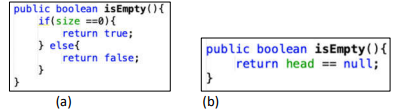
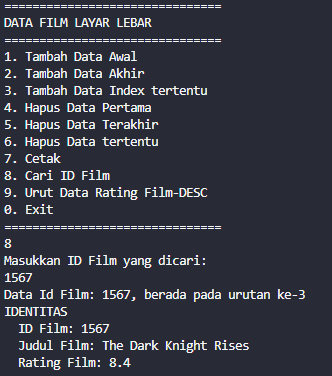
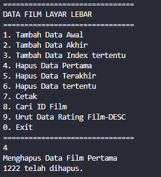
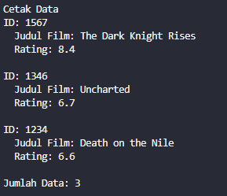
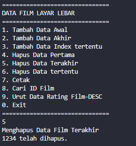

# Laporan Jobsheet 10 - Double Linked List
#### Nama : Alvanza Saputra Yudha
#### Kelas : 1-H
#### NIM : 2341720182

<hr>

# Praktikum 

* ## 12.2 Kegiatan Praktikum 1

    - Class Node
    ```java
    public class Node {
        int data;
        Node next, prev;

        Node(Node prev, int data, Node next) {
            this.data = data;
            this.next = next;
            this.prev = prev;
        }
    }
    ```

    - Class DoubleLinkedLists
    ```java
    public class DoubleLinkedLists {
        Node head;
        int size;

        DoubleLinkedLists() {
            head = null;
            size = 0;
        }

        public boolean isEmpty() {
            return head == null;
        }

        public void addFirst(int item) {
            if(isEmpty()) {
                head = new Node(null, item, null);
            } else {
                Node newNode = new Node(null, item, head);
                head.prev = newNode;
                head = newNode;
            }
            size++;
        }

        public void addLast(int item) {
            if(isEmpty()) {
                addFirst(item);
            } else {
                Node current = head;
                while(current.next != null) {
                    current = current.next;
                }
                Node newNode = new Node(current, item, null);
                current.next = newNode;
                size++;
            }
        }

        public void add(int item, int index) throws Exception {
            if(isEmpty()) {
                addFirst(item);
            } else if (index < 0 || index > size) {
                throw new Exception("Nilai indeks di luar batas");
            } else {
                Node current = head;
                int i = 0;
                while(i < index) {
                    current = current.next;
                    i++;
                }
                if (current.prev == null) {
                    Node newNode = new Node(null, item, current);
                    current.prev = newNode;
                    head = newNode;
                } else {
                    Node newNode = new Node(current.prev, item, current);
                    current.prev.next = newNode;
                    current.prev = newNode;
                }
            }
            size++;
        }

        public int size() {
            return size;
        }

        public void clear() {
            head = null;
            size = 0;
        }

        public void print() {
            if(isEmpty()) {
                System.out.println("Linked lists kosong");
            } else {
                Node tmp = head;
                while(tmp != null) {
                    System.out.print(tmp.data + "\t");
                    tmp = tmp.next;
                }
                System.out.println("\nBerhasil diisi");
            }
        }
    }
    ```

    - Class DoubleLinkedListsMain
    ```java
    public class DoubleLinkedListsMain {
        public static void main(String[] args) throws Exception {
            DoubleLinkedLists dll = new DoubleLinkedLists();

            dll.print();
            System.out.println("Size: " + dll.size());
            System.out.println("==============================");
            dll.addFirst(3);
            dll.addLast(4);
            dll.addFirst(7);
            dll.print();
            System.out.println("Size: " + dll.size());
            System.out.println("==============================");
            dll.add(40, 1);
            dll.print();
            System.out.println("Size: " + dll.size());
            System.out.println("==============================");
            dll.clear();
            dll.print();
            System.out.println("Size: " + dll.size());

        }
    }
    ```

    - Verifikasi Hasil Percobaan 1

    

    ### 12.2.3 Pertanyaan
1. Jelaskan perbedaan antara single linked list dengan double linked lists!
    - Single linked list merupakan linked list yang hanya bisa satu arah saja(next), sedangkan double linked list bisa dua arah(next & prev).

2. Perhatikan class Node, di dalamnya terdapat atribut next dan prev. Untuk apakah atribut tersebut?
    - `next` digunakan untuk menunjuk pada pointer node selanjutnya, sedangkan `prev` digunakan untuk menunjuk pointer node sebelumnya 

3. Perhatikan konstruktor pada class DoubleLinkedLists. Apa kegunaan inisialisasi atribut head dan size seperti pada gambar berikut ini?
    

    - Digunakan inisialisasi `head = null` karena belum ada satupun node yang dibuat. Sedangkan inisialisasi `size = 0` dilakukan karena pada saat awal dibuat, belum terdapat node apapun sehingga sizenya bernilai 0.

4. Pada method addFirst(), kenapa dalam pembuatan object dari konstruktor class Node prev dianggap sama dengan null? 
    ```java
    Node newNode = new Node(null, item, head);
    ```

    - Karena node yang dimasukkan pada method addFirst() akan menjadi Node `head` dan prev dari head bernilai null.

5. Perhatikan pada method addFirst(). Apakah arti statement head.prev = newNode ?
    - Artinya adalah prev dari head yang lama yang sebelumnya bernilai null akan dimasukkan node yang baru(newNode), Sehingga prev dari `newNode` adalah null dan next dari `newNode` adalah head yang lama.

6. Perhatikan isi method addLast(), apa arti dari pembuatan object Node dengan mengisikan parameter prev dengan current, dan next dengan null?
    ```java
    Node newNode = new Node(current, item, null);
    ```

    - Artinya adalah next dari node current yang sebelumnya bernilai null akan dimasukkan node yang baru(newNode) dan prev dari `newNode` akan dimasukkan node current, sehinnga next dari `newNode` adalah null dan prev dari `newNode` adalah current

7. Pada method add(), terdapat potongan kode program sebagai berikut:
    

    jelaskan maksud dari bagian yang ditandai dengan kotak kuning.

    - Maksud dari bagian tersebut adalah jika current adalah head maka akan dibuat `newNode` dengan next berada pada current dan prev bernilai null. Lalu prev dari current akan dimasukkan `newNode` dan `newNode` akan menjadi head.

* ## 12.3 Kegiatan Praktikum 2

    - Tambahan class DoubleLinkedLists
    ```java
    public void removeFirst() throws Exception {
        if(isEmpty()) {
            throw new Exception("Linked List masih kosong, tidak dapat dihapus!");
        } else if (size == 1) {
            removeLast();
        } else {
            head = head.next;
            head.prev = null;
            size--;
        }
    }

    public void removeLast() throws Exception {
        if(isEmpty()) {
            throw new Exception("Linked List masih kosong, tidak dapat dihapus!");
        } else if (head.next == null) {
            head = null;
            size--;
            return;
        }
        Node current = head;
        while (current.next.next != null) {
            current = current.next;
        }
        current.next = null;
        size--;
    }

    public void remove(int index) throws Exception {
        if (isEmpty() || index >= size) {
            throw new Exception("Nilai indeks di luar batas");
        } else if (index == 0) {
            removeFirst();
        } else {
            Node current = head;
            int i = 0;
            while(i < index) {
                current = current.next;
                i++;
            }
            if (current.next == null) {
                current.prev.next = null;
            } else if (current.prev == null) {
                current = current.next;
                current.prev = null;
                head = current;
            } else {
                current.prev.next = current.next;
                current.next.prev = current.prev;
            }
            size--;
        }
    }
    ```

    - Class DoubleLinkedListsMain
    ```java
    public class DoubleLinkedListsMain {
        public static void main(String[] args) throws Exception {
            DoubleLinkedLists dll = new DoubleLinkedLists();

            dll.addLast(50);
            dll.addLast(40);
            dll.addLast(10);
            dll.addLast(20);
            dll.print();
            System.out.println("Size: " + dll.size());
            System.out.println("===========================");
            dll.removeFirst();
            dll.print();
            System.out.println("Size: " + dll.size());
            System.out.println("===========================");
            dll.removeLast();
            dll.print();
            System.out.println("Size: " + dll.size());
            System.out.println("===========================");
            dll.remove(1);
            dll.print();
            System.out.println("Size: " + dll.size());
        }
    }
    ```

    - Verifikasi Hasil Percobaan 2

    

    ### 12.3.3 Pertanyaan
1. Apakah maksud statement berikut pada method removeFirst()?
    ```java
    head = head.next;
    head.prev = null;
    ```

    - Maksudnya adalah Node selanjutnya dari head akan menjadi head yang baru lalu prev dari head yang baru akan menjadi null

2. Bagaimana cara mendeteksi posisi data ada pada bagian akhir pada method removeLast()?
    - Dengan menggunakan sintaks berikut
    ```java
    while (current.next.next != null) {
        current = current.next;
    }
    ```
    jadi sintaks tersebut untuk menggeser node current sampai nilai dari `current.next.next == null`, Karena jika `current.next.next == null` maka node current adalah prev dari node yang ada pada bagian akhir data. Sehingga kita bisa menghapus node current.next.

3. Jelaskan alasan potongan kode program di bawah ini tidak cocok untuk perintah remove!

    

    - Karena nilai dari tmpnya head.next. Karena hal itu kita jadi tidak bisa mengganti node headnya atau memasukkan node baru pada index 0.

4. Jelaskan fungsi kode program berikut ini pada fungsi remove!

    

    - Jadi, pointer next dari node sebelum current akan menunjuk pada node setelah current dan pointer prev dari node setelah current akan menunjuk pada node sebelum current.

* ## 12.4 Kegiatan Praktikum 3

    - Tambahan Class DoubleLinkedLists
    ```java
    public int getFirst() throws Exception {
        if(isEmpty()) {
            throw new Exception("Linked List kosong");
        }
        return head.data;
    }

    public int getLast() throws Exception {
        if(isEmpty()) {
            throw new Exception("Linked List kosong");
        } 
        Node tmp = head;
        while (tmp.next != null) {
            tmp = tmp.next;
        }
        return tmp.data;
    }

    public int get(int index) throws Exception {
        if (isEmpty() || index >= size) {
            throw new Exception("Nilai indeks di luar batas");
        }
        Node tmp = head;
        for (int i = 0; i < index; i++) {
            tmp = tmp.next;
        }
        return tmp.data;
    }
    ```

    - Class DoubleLinkedListsMain
    ```java
    public class DoubleLinkedListsMain {
        public static void main(String[] args) throws Exception {
            DoubleLinkedLists dll = new DoubleLinkedLists();

            dll.print();
            System.out.println("Size: " + dll.size());
            System.out.println("==============================");
            dll.addFirst(3);
            dll.addLast(4);
            dll.addFirst(7);
            dll.print();
            System.out.println("Size: " + dll.size());
            System.out.println("==============================");
            dll.add(40, 1);
            dll.print();
            System.out.println("Size: " + dll.size());
            System.out.println("==============================");
            System.out.println("Data awal pada Linked Lists adalah: " + dll.getFirst());
            System.out.println("Data akhir pada Linked Lists adalah: " + dll.getLast());
            System.out.println("Data indeks ke-1 pada Linked Lists adalah: " + dll.get(1));
        }
    }
    ```

    - Verifikasi Hasil Percobaan 3

    

    ### 12.4.3 Pertanyaan
1. Jelaskan method size() pada class DoubleLinkedLists!
    - Untuk mengembalikan nilai dari variabel size.

2. Jelaskan cara mengatur indeks pada double linked lists supaya dapat dimulai dari indeks ke-1!
    - Caranya adalah dengan mengatur iterasi dan mengubah pointer pada method `add()` dan `get()` untuk memulai dari indeks ke-1 dan melakukan pengecekan jika i sama dengan index

3. Jelaskan perbedaan karakteristik fungsi Add pada Double Linked Lists dan Single Linked Lists!
    - Jika Single Linked Lists hanya merubah next saja karena Linked Listnya satu arah Sedangkan Double Linked Lists merubah next dan previous karena Linked Listsnya 2 arah.

4. Jelaskan perbedaan logika dari kedua kode program di bawah ini!

    

    - Gambar `a` melakukan pengecekan pada atribut size menggunakan algoritma if-else sedangkan gambar `b` melakukan pengecekan secara langsung pada atribut head.

* ## 12.5 Tugas Praktikum
1. Buat program antrian vaksinasi menggunakan queue berbasis double linked list sesuai ilustrasi dan menu di bawah ini! (counter jumlah antrian tersisa di menu cetak(3) dan data orang yang telah divaksinasi di menu Hapus Data(2) harus ada)

    - Class Penerima
    ```java
    public class Penerima {
        int no;
        String nama;

        Penerima(int no, String nama) {
            this.no = no;  
            this.nama = nama;
        }
    }
    ```

    - Class Node
    ```java
    public class Node {
        Penerima data;
        Node next, prev;

        Node(Node prev, Penerima data, Node next) {
            this.data = data;
            this.next = next;
            this.prev = prev;
        }
    }
    ```

    - Class DoubleLinkedLists
    ```java
    public class DLL {
        Node head;
        int size;

        DLL() {
            head = null;
            size = 0;
        }

        public boolean isEmpty() {
            return head == null;
        }

        public void addLast(Penerima item) {
            if(isEmpty()) {
                head = new Node(null, item, null);
                size++;
            } else {
                Node current = head;
                while(current.next != null) {
                    current = current.next;
                }
                Node newNode = new Node(current, item, null);
                current.next = newNode;
                size++;
            }
            System.out.println("Antrian Berhasil Ditambahkan!!!");
        }

        public void removeFirst() throws Exception {
            Node temp = head;
            if(isEmpty()) {
                throw new Exception("Linked List masih kosong, tidak dapat dihapus!");
            } else if (size == 1) {
                head = null;
                size--;
                // return;
            } else {
                head = head.next;
                head.prev = null;
                size--;
            }
            System.out.println(temp.data.nama + " telah selesai divaksinisasi.");
            print();
        }

        public void print() {
            if(isEmpty()) {
                System.out.println("Linked lists kosong");
            } else {
                Node tmp = head;
                int i = 0;
                System.out.println("------------------------------");
                System.out.println("Daftar Pengantri Vaksin");
                System.out.println("------------------------------");
                System.out.println("|No.\t|Nama\t|");
                while(tmp != null) {
                    System.out.print("|" + tmp.data.no + "\t|" + tmp.data.nama + "\t|\n");
                    tmp = tmp.next;
                    i++;
                }
                System.out.println("Sisa Antrian: " + i);
            }
        }
    }
    ```

    - Class Main
    ```java
    public class DLLMain {
        public static void menu() {
            System.out.println("\n++++++++++++++++++++++++++++++");
            System.out.println("PENGANTRI VAKSIN EXTRAVAGANZA");
            System.out.println("++++++++++++++++++++++++++++++\n");
            System.out.println("1. Tambah Data Penerima Vaksin");
            System.out.println("2. Hapus Data Pengantri Vaksin");
            System.out.println("3. Daftar Penerima Vaksin");
            System.out.println("4. Keluar");
            System.out.println("++++++++++++++++++++++++++++++");
        }

        public static void main(String[] args) throws Exception {

            Scanner sc = new Scanner(System.in);

            DLL dll = new DLL();

            do {
                menu();
                int pilih = sc.nextInt();
                sc.nextLine();

                switch (pilih) {
                    case 1:
                        System.out.println("------------------------------");
                        System.out.println("Masukkan Data Penerima Vaksin");
                        System.out.println("------------------------------");
                        System.out.println("Nomor Antrian : ");
                        int no = sc.nextInt();
                        sc.nextLine();
                        System.out.println("Nama Penerima : ");
                        String nama = sc.nextLine();
                        dll.addLast(new Penerima(no, nama));
                        break;

                    case 2:
                        dll.removeFirst();
                        break;

                    case 3:
                        dll.print();
                        break;

                    case 4:
                        System.exit(4);
                        break;
                
                    default:
                        System.out.println("Pilihan yang anda masukkan salah, silahkan coba lagi\n");
                        break;
                }
            } while (true);
        }
    }
    ```

    - Input data pengantri vaksin

    

    - Daftar antrian penerima vaksin

    

    - Menghapus data pengantri vaksin

    

2. Buatlah program daftar film yang terdiri dari id, judul dan rating menggunakan double linked lists, bentuk program memiliki fitur pencarian melalui ID Film dan pengurutan Rating secara descending. Class Film wajib diimplementasikan dalam soal ini.

    - Class Film
    ```java
    public class Film {
        int id;
        String judul;
        double rating;

        Film(int id, String judul, double rating) {
            this.id = id;
            this.judul = judul;
            this.rating = rating;
        }
    }
    ```

    - Class Node 
    ```java
    public class Node {
        Film data;
        Node next, prev;

        Node(Node prev, Film data, Node next) {
            this.data = data;
            this.next = next;
            this.prev = prev;
        }
    }
    ```

    - Class DoubleLinkedLists
    ```java
    public class DLL {
        Node head;
        int size;

        DLL() {
            head = null;
            size = 0;
        }

        public boolean isEmpty() {
            return head == null;
        }

        public void addFirst(Film item) {
            if(isEmpty()) {
                head = new Node(null, item, null);
            } else {
                Node newNode = new Node(null, item, head);
                head.prev = newNode;
                head = newNode;
            }
            size++;
        }

        public void addLast(Film item) {
            if(isEmpty()) {
                addFirst(item);
            } else {
                Node current = head;
                while(current.next != null) {
                    current = current.next;
                }
                Node newNode = new Node(current, item, null);
                current.next = newNode;
                size++;
            }
        }

        public void add(Film item, int index) throws Exception {
            if(isEmpty()) {
                addFirst(item);
            } else if (index < 0 || index > size) {
                throw new Exception("Nilai indeks di luar batas");
            } else {
                Node current = head;
                int i = 1;
                while(i < index) {
                    current = current.next;
                    i++;
                }
                if (current.prev == null) {
                    Node newNode = new Node(null, item, current);
                    current.prev = newNode;
                    head = newNode;
                } else {
                    Node newNode = new Node(current.prev, item, current);
                    current.prev.next = newNode;
                    current.prev = newNode;
                }
            }
            size++;
        }

        public void print() {
            if(isEmpty()) {
                System.out.println("Linked lists kosong");
            } else {
                Node tmp = head;
                int i = 0;
                while(tmp != null) {
                    System.out.print("ID: " + tmp.data.id + "\n  Judul Film: " + tmp.data.judul + "\n  Rating: " + tmp.data.rating + "\n\n");
                    tmp = tmp.next;
                    i++;
                }
                System.out.println("Jumlah Data: " + i);
            }
        }

        public void removeFirst() throws Exception {
            Node temp = head;
            if(isEmpty()) {
                throw new Exception("Linked List masih kosong, tidak dapat dihapus!");
            } else if (size == 1) {
                removeLast();
            } else {
                head = head.next;
                head.prev = null;
                size--;
            }
            System.out.println(temp.data.id + " telah dihapus.");
        }

        public void removeLast() throws Exception {
            if(isEmpty()) {
                throw new Exception("Linked List masih kosong, tidak dapat dihapus!");
            } else if (head.next == null) {
                head = null;
                size--;
                return;
            }
            Node current = head;
            while (current.next.next != null) {
                current = current.next;
            }
            System.out.println(current.next.data.id + " telah dihapus.");
            current.next = null;
            size--;
        }

        public void remove(int index) throws Exception {
            if (isEmpty() || index > size) {
                throw new Exception("Nilai indeks di luar batas");
            } else if (index == 1) {
                removeFirst();
            } else {
                Node current = head;
                int i = 1;
                while(i < index) {
                    current = current.next;
                    i++;
                }
                System.out.println(current.data.id + " pada index ke-" + index + " telah dihapus.");
                if (current.next == null) {
                    current.prev.next = null;
                } else if (current.prev == null) {
                    current = current.next;
                    current.prev = null;
                    head = current;
                } else {
                    current.prev.next = current.next;
                    current.next.prev = current.prev;
                }
                size--;
            }
        }

        public void search(int id) {
            int posisi = -1;
            Node current = head;
            int i = 1;
            while(current != null) {
                if(current.data.id == id) {
                    posisi = i;
                    break;
                }
                current = current.next;
                i++;
            }

            if (posisi != -1) {
                System.out.println("Data Id Film: " + id + ", berada pada urutan ke-" + posisi);
                System.out.println("IDENTITAS");
                System.out.println("  ID Film: " + current.data.id);
                System.out.println("  Judul Film: " + current.data.judul);
                System.out.println("  Rating Film: " + current.data.rating);
            } else {
                System.out.println("Data Id Film: " + id + ", tidak ditemukan");
            }
        }

        public void sorting() {
            Node current;
            Node index;
            Film temp;
        
            if (!isEmpty()) {
                current = head;
                while (current != null) {
                    index = current.next;
                    while (index != null) {
                        if (current.data.rating < index.data.rating) {
                            temp = current.data;
                            current.data = index.data;
                            index.data = temp;
                        }
                        index = index.next;
                    }
                    current = current.next;
                }
            } else {
                System.out.println("Linked list masih kosong, tidak dapat mengurutkan data!");
            }
        }
        
    }
    ```

    - Class Main
    ```java
    public class Main {

        public static void menu() {
            System.out.println("===============================");
            System.out.println("DATA FILM LAYAR LEBAR");
            System.out.println("===============================");
            System.out.println("1. Tambah Data Awal");
            System.out.println("2. Tambah Data Akhir");
            System.out.println("3. Tambah Data Index tertentu");
            System.out.println("4. Hapus Data Pertama");
            System.out.println("5. Hapus Data Terakhir");
            System.out.println("6. Hapus Data tertentu");
            System.out.println("7. Cetak");
            System.out.println("8. Cari ID Film");
            System.out.println("9. Urut Data Rating Film-DESC");
            System.out.println("0. Exit");
            System.out.println("===============================");
        }

        public static Film inputData() {
            Scanner sc = new Scanner(System.in);

            System.out.println("ID Film : ");
            int id = sc.nextInt();
            sc.nextLine();
            System.out.println("Judul Film : ");
            String jdl = sc.nextLine();
            System.out.println("Rating Film : ");
            double rating = sc.nextDouble();
            sc.nextLine();

            return new Film(id, jdl, rating);
        }

        public static void main(String[] args) throws Exception {
            Scanner sc = new Scanner(System.in);

            DLL dll = new DLL();

            do {
                menu();
                int pilih = sc.nextInt();
                sc.nextLine();
                switch (pilih) {
                    case 1:
                        System.out.println("Masukkan Data Film Posisi Awal");
                        dll.addFirst(inputData());
                        break;

                    case 2:
                        System.out.println("Masukkan Data Film Posisi Akhir");
                        dll.addLast(inputData());
                        break;

                    case 3:
                        System.out.println("Masukkan Data Film");
                        Film dt = inputData();
                        System.out.println("Data Film dimasukkan pada urutan ke-");
                        int idx = sc.nextInt();
                        dll.add(dt, idx);
                        break;

                    case 4:
                        System.out.println("Menghapus Data Film Pertama");
                        dll.removeFirst();
                        break;

                    case 5:
                        System.out.println("Menghapus Data Film Terakhir");
                        dll.removeLast();
                        break;

                    case 6:
                        System.out.println("Menghapus Data");
                        System.out.println("Masukkan urutan film : ");
                        int idx1 = sc.nextInt();
                        dll.remove(idx1);
                        break;

                    case 7:
                        System.out.println("Cetak Data");
                        dll.print();
                        break;

                    case 8:
                        System.out.println("Masukkan ID Film yang dicari: ");
                        int idx2 = sc.nextInt();
                        dll.search(idx2);
                        break;

                    case 9:
                        System.out.println("Mengurutkan Data Rating Film-DESC");
                        dll.sorting();
                        dll.print();
                        break;

                    case 0:
                        System.exit(0);
                        break;
                
                    default:
                        System.out.println("Pilihan Tidak Tersedia\n");
                        break;
                }
            } while (true);
        }
    }
    ```

    - Input Data Film Pertama

    

    - Input Data Film Akhir

    

    - Input Data Film Pada Urutan 4 (Index dimulai dari 1)

    

    - Cetak Data Film

    

    - Cari Data Film Dengan ID Film (index dimulai dari 1)

    

    - Mengurutkan Data Film Berdasarkan Rating(Descending
    
    )

    - Hapus Data Pada Urutan 3

    

    

    - Hapus Data Awal

    

    

    - Hapus Data Akhir

    

    
