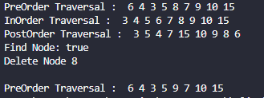

# Laporan Jobsheet 13 - Tree
#### Nama : Alvanza Saputra Yudha
#### Kelas : 1-H
#### NIM : 2341720182

<hr>

# Praktikum 

* ## 13.2 Kegiatan Praktikum 1

    - Class Node04
    ```java
    public class Node04 {
        int data;
        Node04 left;
        Node04 right;

        Node04() {
            
        }

        Node04(int data) {
            this.left = null;
            this.data = data;
            this.right = null;
        }
    }
    ```

    - Class BinaryTree04
    ```java
    public class BinaryTree04 {
        Node04 root;

        public BinaryTree04() {
            root = null;
        }

        boolean isEmpty() {
            return root != null;
        }

        void add(int data) {
            if(!isEmpty()) {
                root = new Node04(data);
            } else {
                Node04 current = root;
                while (true) { 
                    if(data > current.data) {
                        if(current.right == null) {
                            current.right = new Node04(data);
                        } else {
                            current = current.right;
                        }
                    } else if(data < current.data) {
                        if(current.left == null) {
                            current.left = new Node04(data);
                        } else {
                            current = current.left;
                        }
                    } else {
                        break;
                    }
                }
            }
        }

        boolean find(int data) {
            boolean result = false;
            Node04 current = root;
            while(current != null) {
                if(current.data == data) {
                    result = true;
                    break;
                } else if(data > current.data) {
                    current = current.right;
                } else if(data < current.data) {
                    current = current.left;
                }
            }
            return result;
        }

        void traversePreOrder(Node04 node) {
            if(node != null) {
                System.out.print(" " + node.data);
                traversePreOrder(node.left);
                traversePreOrder(node.right);
            }
        }

        void traversePostOrder(Node04 node) {
            if(node != null) {
                traversePostOrder(node.left);
                traversePostOrder(node.right);
                System.out.print(" " + node.data);
            }
        }

        void traverseInOrder(Node04 node) {
            if(node != null) {
                traverseInOrder(node.left);
                System.out.print(" " + node.data);
                traverseInOrder(node.right);
            }
        }

        Node04 getSuccessor(Node04 del) {
            Node04 successor = del.right;
            Node04 successorParent = del;
            while(successor.left != null) {
                successorParent = successor;
                successor = successor.left;
            }
            if(successor != del.right) {
                successorParent.left = successor.right;
                successor.right = del.right;
            }
            return successor;
        }

        void delete(int data) {
            if(!isEmpty()) {
                System.out.println("Tree is empty!");
                return;
            }
            // find node (current) that will be deleted
            Node04 parent = root;
            Node04 current = root;
            boolean isLeftChild = false;
            while(current != null) {
                if(current.data == data) {
                    break;
                } else if(data < current.data) {
                    parent = current;
                    current = current.left;
                    isLeftChild = true;
                } else if(data > current.data) {
                    parent = current;
                    current = current.right;
                    isLeftChild = false;
                }
            }
            // deletion
            if(current == null) {
                System.out.println("Couldn`t find data!");
                return;
            } else {
                // if no child, simply delete it
                if(current.left == null && current.right == null) {
                    if(current == root) {
                        root = null;
                    } else {
                        if(isLeftChild) {
                            parent.left = null;
                        } else {
                            parent.right = null;
                        }
                    }
                // if there is 1 child (right)
                } else if(current.left == null) {
                    if(current == root) {
                        root = current.right;
                    } else {
                        if (isLeftChild) {
                            parent.left = current.right;
                        } else {
                            parent.right = current.right;
                        }
                    }
                // if there is 2 childs    
                } else {
                    Node04 successor = getSuccessor(current);
                    if(current == root) {
                        root = successor;
                    } else {
                        if(isLeftChild) {
                            parent.left = successor;
                        } else {
                            parent.right = successor;
                        }
                        successor.left = current.left;
                    }
                }
            }
        }
    }
    ```

    - Class BinaryTreeMain04
    ```java
    public class BinaryTreeMain04 {
        public static void main(String[] args) {
            BinaryTree04 bt = new BinaryTree04();
            bt.add(6);
            bt.add(4);
            bt.add(8);
            bt.add(3);
            bt.add(5);
            bt.add(7);
            bt.add(9);
            bt.add(10);
            bt.add(15);
            System.out.print("PreOrder Traversal : ");
            bt.traversePreOrder(bt.root);
            System.out.println();
            System.out.print("InOrder Traversal : ");
            bt.traverseInOrder(bt.root);
            System.out.println();
            System.out.print("PostOrder Traversal : ");
            bt.traversePostOrder(bt.root);
            System.out.println();
            System.out.println("Find Node: " + bt.find(5));
            System.out.println("Delete Node 8");
            bt.delete(8);
            System.out.println();
            System.out.print("PreOrder Traversal : ");
            bt.traversePreOrder(bt.root);
            System.out.println();
        }
    }
    ```

    - Verifikasi Hasil Percobaan 1

    

    ### 13.2.2 Pertanyaan Percobaan
1. Mengapa dalam binary search tree proses pencarian data bisa lebih efektif dilakukan dibanding binary tree biasa?
    - Karena binary search tree mempunyai bentuk khusus yaitu dengan sifat bahwa semua left-child harus lebih kecil daripada right-child dan parent-nya

2. Untuk apakah di class Node, kegunaan dari atribut left dan right?
    - Left untuk menunjuk left-child dari parent(data) dan right untuk menunjuk right-child dari parent(data)

3.  a. Untuk apakah kegunaan dari atribut root di dalam class BinaryTree?
    - Untuk inisialiasasi Node khusus dalam tree yang tidak memiliki predesesor

    b. Ketika objek tree pertama kali dibuat, apakah nilai dari root?
    - Nilainya adalah null

4. Ketika tree masih kosong, dan akan ditambahkan sebuah node baru, proses apa yang akan terjadi?
    - Proses yang terjadi adalah data yang ada akan menjadi root lalu left-child dan right-child akan diberi nilai null untuk pertama kali.

5. Perhatikan method add(), di dalamnya terdapat baris program seperti di bawah ini. Jelaskan secara detil untuk apa baris program tersebut?
    ```java
    if(data<current.data){
        if(current.left!=null){
            current = current.left;
        } else {
            current.left = new Node(data);
            break;
        }
    }
    ```

    - Pertama dilakukan pengecekan apakah data yang akan dimasukkan lebih kecil dari current.data. Jika ya dilakukan pengecekan lagi apakah left dari current.data null atau tidak. jika tidak null, maka nilai dari current digantikan dengan left-child dari current dan iterasi akan diulang sampai left-child dari current bernilai null. Jika left-child sudah bernilai null maka data akan dimasukkan disana(left-child dari current).
    
* ## 13.3 Kegiatan Praktikum 2

    - Class BinaryTreeArray04
    ```java
    public class BinaryTreeArray04 {
        int[] data;
        int idxLast;

        public BinaryTreeArray04() {
            data = new int[10];
        }

        void populateData(int data[], int idxLast) {
            this.data = data;
            this.idxLast = idxLast;
        }

        void traverseInOrder(int idxStart) {
            if(idxStart <= idxLast) {
                traverseInOrder(2*idxStart+1);
                System.out.print(data[idxStart] + " ");
                traverseInOrder(2*idxStart+2);
            }
        }
    }
    ```

    - Class BinaryTreeMain04
    ```java
    public class BinaryTreeMain04 {
        public static void main(String[] args) {
            BinaryTreeArray04 bta = new BinaryTreeArray04();
            int[] data = {6, 4, 8, 3, 5, 7, 9, 0, 0, 0};
            int idxLast = 6;
            bta.populateData(data, idxLast);
            System.out.print("\nInOrder Traversal: ");
            bta.traverseInOrder(0);
            System.out.println("\n");
        }
    }
    ```

    - Verifikasi Hasil Percobaan 2

    

    ### 13.2.2 Pertanyaan Percobaan
1. Apakah kegunaan dari atribut data dan idxLast yang ada di class BinaryTreeArray?
    - Atribut data digunakan untuk menampung data dari Main yang akan diolah dan atrbut idxLast digunakan untuk menentukan batasan dari data yang akan digunakan

2. Apakah kegunaan dari method populateData()?
    - Untuk menginisialisasi atribut data dan idxLast

3. Apakah kegunaan dari method traverseInOrder()?
    - Untuk membuat tree secara traverseInOrder dan menampilkannya dengan menggunakan rumus `2*idxStart+1` untuk left-child dan `2*idxStart+2` untuk right-child

4. Jika suatu node binary tree disimpan dalam array indeks 2, maka di indeks berapakah posisi left child dan rigth child masing-masing?
    - left-child : indeks 5 dan right-child : 6

5. Apa kegunaan statement int idxLast = 6 pada praktikum 2 percobaan nomor 4?
    - Untuk memberi batasan array yang digunakan hanya sampai index ke-6
    
* ## 13.4 Tugas Praktikum
1. Buat method di dalam class BinaryTree yang akan menambahkan node dengan cara rekursif.
    - Perubahan Method add()
        ```java
        void add(int data) {
            addRekursif(root, data);
        }

        void addRekursif(Node04 node, int data) {
            if (!isEmpty()) {
                root = new Node04(data);
            } else if (data > node.data) {
                if (node.right == null) {
                    node.right = new Node04(data);
                } else {
                    addRekursif(node.right, data);
                }
            } else if (data < node.data) {
                if (node.left == null) {
                    node.left = new Node04(data);
                } else {
                    addRekursif(node.left, data);
                }
            }
        }
        ```

    - Output

        

2. Buat method di dalam class BinaryTree untuk menampilkan nilai paling kecil dan yang paling besar yang ada di dalam tree.
    - Method 

3. Buat method di dalam class BinaryTree untuk menampilkan data yang ada di leaf.
    - a

4. Buat method di dalam class BinaryTree untuk menampilkan berapa jumlah leaf yang ada di dalam tree.
    - a

5. Modifikasi class BinaryTreeArray, dan tambahkan :

    • method add(int data) untuk memasukan data ke dalam tree

    • method traversePreOrder() dan traversePostOrder()
    - a