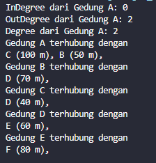
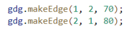

# Laporan Jobsheet 12 - Graph
#### Nama : Alvanza Saputra Yudha
#### Kelas : 1-H
#### NIM : 2341720182

<hr>

# Praktikum 

* ## 2.1 Percobaan 1: Implementasi Graph menggunakan Linked List

    - Class Node04
    ```java
    public class Node04 {
        int data;
        Node04 prev, next;
        int jarak;

        Node04(Node04 prev, int data, int jarak, Node04 next) {
            this.prev = prev;
            this.data = data;
            this.next = next;
            this.jarak = jarak;
        }
    }
    ```

    - Class DoubleLinkedList04
    ```java
    public class DoubleLinkedList04 {
        Node04 head;
        int size;

        DoubleLinkedList04() {
            head = null;
            size = 0;
        }

        public boolean isEmpty() {
            return head == null;
        }
        public void addFirst(int item, int jarak) {
            if(isEmpty()) {
                head = new Node04(null, item, jarak, null);
            } else {
                Node04 newNode = new Node04(null, item, jarak, head);
                head.prev = newNode;
                head = newNode;
            }
            size++;
        }

        public int getJarak(int index) throws Exception {
            if(isEmpty() || index >= size) {
                throw new Exception("Nilai indeks di luar batas");
            }
            Node04 tmp = head;
            for(int i = 0; i < index; i++) {
                tmp = tmp.next;
            }
            return tmp.jarak;
        }

        public void remove(int index) {
            Node04 current = head;
            while(current != null) {
                if(current.data == index) {
                    if(current.prev != null) {
                        current.prev.next = current.next;
                    } else {
                        head = current.next;
                    }
                    if(current.next != null) {
                        current.next.prev = current.prev;
                    }
                    break;
                }
                current = current.next;
            }
            size--;
        }

        public int get(int index) throws Exception {
            if (index >= size) {
                throw new Exception("Nilai indeks di luar batas");
            }
            Node04 tmp = head;
            for (int i = 0; i < index; i++) {
                tmp = tmp.next;
            }
            return tmp.data;
        }

        public int size() {
            return size;
        }

        public void clear() {
            head = null;
            size = 0;
        }
    }
    ```

    - class Graph04
    ```java
    public class Graph04 {
        int vertex;
        DoubleLinkedList04 list[];

        public Graph04(int v) {
            vertex = v;
            list = new DoubleLinkedList04[v];
            for(int i = 0; i < v; i++) {
                list[i] = new DoubleLinkedList04();
            }
        }

        public void addEdge(int asal, int tujuan, int jarak) {
            list[asal].addFirst(tujuan, jarak);
            // undirect graph
            //list[tujuan].addFirst(asal, jarak);
        }
        
        public void degree(int asal) throws Exception {
            int k , totalIn = 0, totalOut = 0;
            for(int i = 0 ; i < vertex; i++) {
                // inDegree
                for(int j = 0; j < list[i].size(); j++) {
                    if(list[i].get(j) == asal) {
                        ++totalIn;
                    }
                }
                // outDegree
                for(k = 0; k < list[asal].size(); k++) {
                    list[asal].get(k);
                }
                totalOut = k;
            }
            System.out.println("InDegree dari Gedung " + (char) ('A' + asal) + ": " + totalIn);
            System.out.println("OutDegree dari Gedung " + (char) ('A' + asal) + ": " + totalOut);
            System.out.println("Degree dari Gedung " + (char) ('A' + asal) + ": " + (totalOut + totalIn));
            // Undirect Graph
            // System.out.println("Degree dari Gedung " + (char) ('A' + asal) + ": " + list[asal].size());
        }

        public void removeEdge(int asal, int tujuan) throws Exception {
            for(int i = 0; i < vertex; i++) {
                if(i == tujuan) {
                    list[asal].remove(tujuan);
                }
            }
        }

        public void removeAllEdge() {
            for(int i = 0; i < vertex; i++) {
                list[i].clear();
            }
            System.out.println("Graph berhasil dikosongkan!");
        }

        public void printGraph() throws Exception {
            for(int i = 0; i < vertex; i++) {
                if(list[i].size() > 0) {
                    System.out.println("Gedung " + (char) ('A' + i) + " terhubung dengan ");
                    for(int j = 0; j < list[i]. size(); j++) {
                        System.out.print((char) ('A' + list[i].get(j)) + " (" + list[i].getJarak(j) + " m), ");
                    }
                    System.out.println();
                }
            }
            System.out.println();
        }
    }
    ```

    - Class GraphMain04
    ```java
    public class GraphMain04 {
        public static void main(String[] args) throws Exception {
            Graph04 gedung = new Graph04(6);
            gedung.addEdge(0, 1, 50);
            gedung.addEdge(0, 2, 100);
            gedung.addEdge(1, 3, 70);
            gedung.addEdge(2, 3, 40);
            gedung.addEdge(3, 4, 60);
            gedung.addEdge(4, 5, 80);
            gedung.degree(0);
            gedung.printGraph();
            gedung.removeEdge(1, 3);
            gedung.printGraph();
        }
    }
    ```

    - Verifikasi Hasil Percobaan langkah 14

    

    - Verifikasi Hasil Percobaan langkah 17

    

    ### 2.1.3 Pertanyaan
1. Perbaiki kode program Anda apabila terdapat error atau hasil kompilasi kode tidak sesuai!

2. Pada class Graph, terdapat atribut list[] bertipe DoubleLinkedList. Sebutkan tujuan pembuatan variabel tersebut!
    - Tujuan pembuatan variabel ini adalah untuk menyimpan informasi tentang koneksi antara vertex dalam grafik.

3. Jelaskan alur kerja dari method removeEdge!
    - Method removeEdge digunakan untuk menghapus edge antara dua vertex dalam grafik. Menerima parameter asal dan tujuan, method ini melakukan perulangan dan menghapus edge dari list[asal] jika kondisi terpenuhi.

4. Apakah alasan pemanggilan method addFirst() untuk menambahkan data, bukan method add jenis lain saat digunakan pada method addEdge pada class Graph?
    - Untuk memastikan supaya edge yang baru berada pada head/awal node

5. Modifikasi kode program sehingga dapat dilakukan pengecekan apakah terdapat jalur antara suatu node dengan node lainnya, seperti contoh berikut (Anda dapat memanfaatkan Scanner).

    

    - Method `cekEdge()`
    ```java
    public void cekEdge(int asal, int tujuan) throws Exception {
        boolean cek = false;
        for(int i = 0; i < list[asal].size(); i++) {
            if(list[asal].get(i) == tujuan) {
                cek = true;
            }
        }
        if(cek == true) {
            System.out.println("Gedung " + (char) ('A' + asal) + " dan " + (char) ('A' + tujuan) + " bertetangga");
        } else {
            System.out.println("Gedung " + (char) ('A' + asal) + " dan " + (char) ('A' + tujuan) + " tidak bertetangga");
        }
    }
    ```

    - Output

    


* ## 2.2 Percobaan 2: Implementasi Graph menggunakan Matriks

    - class GraphMatriks04
    ```java
    public class GraphMatriks04 {
        int vertex;
        int [][] matriks;

        public GraphMatriks04(int v) {
            vertex = v;
            matriks = new int[v][v];
        }

        public void makeEdge(int asal, int tujuan, int jarak) {
            matriks[asal][tujuan] = jarak;
        }

        public void removeEdge(int asal, int tujuan) {
            matriks[asal][tujuan] = 0;
        }

        public void printGraph() {
            for(int i = 0; i < vertex; i++) {
                System.out.print("Gedung " + (char) ('A' + i) + ": ");
                for(int j = 0; j < vertex; j++) {
                    if(matriks[i][j] != -1) {
                        System.out.print("Gedung " + (char) ('A' + j) + " (" + matriks[i][j] + " m), ");
                    }
                }
                System.out.println();
            }
        }
    }
    ```

    - Tambahan Class GraphMain04
    ```java
    // Graph Matriks
    GraphMatriks04 gdg = new GraphMatriks04(4);
    gdg.makeEdge(0, 1, 50);
    gdg.makeEdge(1, 0, 60);
    gdg.makeEdge(1, 2, 70);
    gdg.makeEdge(2, 1, 80);
    gdg.makeEdge(2, 3, 40);
    gdg.makeEdge(3, 0, 90);
    gdg.printGraph();
    System.out.println("Hasil setelah penghapusan edge");
    gdg.removeEdge(2, 1);
    gdg.printGraph();
    ```

    - Verifikasi Hasil Percobaan 

    

    ### 2.1.3 Pertanyaan
1. Perbaiki kode program Anda apabila terdapat error atau hasil kompilasi kode tidak sesuai!

2. Apa jenis graph yang digunakan pada Percobaan 2?
    - Graph Matriks 

3. Apa maksud dari dua baris kode berikut?

    

    - Membuat edge dari gedung B ke gedung C dengan jarak 70m dan gedung C ke gedung B dengan jarak 80m

4. Modifikasi kode program sehingga terdapat method untuk menghitung degree, termasuk inDegree dan outDegree!
    - Method `degree()`
    ```java
    public void degree(int asal) {
        int totalIn = 0, totalOut = 0;
        for (int i = 0; i < vertex; i++) {
            //indegree
            if (matriks[i][asal] != 0) {
                totalIn++;
            }
            //outdegree
            if (matriks[asal][i] != 0) {
                totalOut++;   
            }
        }
        System.out.println("InDegree dari Gedung " + (char) ('A' + asal) + " : " + totalIn);
        System.out.println("OutDegree dari Gedung " + (char) ('A' + asal) + " : " + totalOut);
        System.out.println("Degree dari Gedung " + (char) ('A' + asal) + " : " + (totalIn + totalOut));
    }
    ```

    - Output

    

* ## 3. Latihan Praktikum

1. Modifikasi kode program pada class GraphMain sehingga terdapat menu program yang bersifat dinamis, setidaknya terdiri dari:

    a) Add Edge

    b) Remove Edge

    c) Degree

    d) Print Graph

    e) Cek Edge

    Pengguna dapat memilih menu program melalui input Scanner
    - class `GraphMain()`
    ```java
    public class GraphMain04 {
        public static int menu() {
            Scanner sc = new Scanner(System.in);
            System.out.println("+------------------------------+");
            System.out.println("|--------- Menu Graph ---------|");
            System.out.println("|------------------------------|");
            System.out.println("| 1. Tambahkan Edge            |");
            System.out.println("| 2. Hapus Edge                |");
            System.out.println("| 3. Hapus Semua Edge          |");
            System.out.println("| 4. Cek Degree                |");
            System.out.println("| 5. Print Graph               |");
            System.out.println("| 6. Cek Edge                  |");
            System.out.println("| 0. Keluar                    |");
            System.out.println("+------------------------------+");
            System.out.print("Masukkan pilihan anda: ");
            int menu = sc.nextInt();
            return menu;
        }

        public static void main(String[] args) throws Exception {
            Scanner sc = new Scanner(System.in);
            Graph04 gedung = new Graph04(6);
            
            while (true) {
                int pilih = menu();
                System.out.println();
                switch (pilih) {
                    case 0:
                    System.exit(0);
                    break;
                    
                    case 1:
                        System.out.println("|--------------------|");
                        System.out.println("|  MENAMBAHKAN EDGE  |");
                        System.out.println("|--------------------|\n");
                        System.out.print("Masukkan gedung asal [index dari 0]: ");
                        int asal = sc.nextInt();
                        System.out.print("Masukkan gedung tujuan [index dari 0]: ");
                        int tujuan = sc.nextInt();
                        System.out.print("Masukkan Jarak: ");
                        int jarak = sc.nextInt();
                        gedung.addEdge(asal, tujuan, jarak);
                    break;

                    case 2:
                        System.out.println("|--------------------|");
                        System.out.println("|   MENGHAPUS EDGE   |");
                        System.out.println("|--------------------|\n");
                        System.out.print("Masukkan gedung asal [index dari 0]: ");
                        int asal1 = sc.nextInt();
                        System.out.print("Masukkan gedung tujuan [index dari 0]: ");
                        int tujuan1 = sc.nextInt();
                        gedung.removeEdge(asal1, tujuan1);
                    break;

                    case 3:
                        System.out.print("Apakah anda yakin ingin menghapus semua edge? [y/n] : ");
                        char p = sc.next().charAt(0);
                        if (p == 'y') {
                            gedung.removeAllEdge();
                        } else if (p == 'n') {
                            System.out.println("Penghapusan seluruh edge dibatalkan!!");
                        }
                    break;
                    
                    case 4:
                        System.out.println("Masukkan index gedung [index dari 0]: ");
                        int index = sc.nextInt();
                        gedung.degree(index);
                    break;

                    case 5:
                        gedung.printGraph();
                    break;

                    case 6:
                        System.out.print("Masukkan gedung asal: ");
                        int asal2 = sc.nextInt();
                        System.out.print("Masukkan gedung tujuan: ");
                        int tujuan2 = sc.nextInt();
                        gedung.cekEdge(asal2, tujuan2);
                    break;
                }
            }
        }
    }
    ```

    - Output Menu

    

    - Output Menambahkan Edge

    

    - Output Print Edge

    

    - Output Menghapus Edge

    

    
2. Tambahkan method updateJarak pada Percobaan 1 yang digunakan untuk mengubah jarak antara dua node asal dan tujuan!
    - Penambahan method `updateJarak()` di class Graph04
    ```java
    public void updateJarak(int asal, int tujuan, int jarakBaru) throws Exception {
        boolean cek = false;
        for(int i = 0; i < list[asal].size(); i++) {
            if(list[asal].get(i) == tujuan) {
                cek = true;
            }
        }
        if (cek == true) {
            list[asal].updateJarak(tujuan, jarakBaru);
            System.out.println("Jarak Gedung " + (char) ('A' + asal) + " dan " + (char) ('A' + tujuan) + " diperbarui menjadi " + jarakBaru + " m");
        } else {
            System.out.println("Gedung " + (char) ('A' + asal) + " dan " + (char) ('A' + tujuan) + " tidak bertetangga");
        }
    }
    ```

    - Penambahan method `updateJarak()` di class DoubleLinkedList04
    ```java
    public void updateJarak(int tujuan, int jarakBaru) throws Exception {
        Node04 current = head;
        boolean cek = false;
        while (current != null) {
            if (current.data == tujuan) {
                current.jarak = jarakBaru;
                cek = true;
                break;
            }
            current = current.next;
        }
        if (!cek) {
            throw new Exception("Tujuan tidak ditemukan dalam daftar");
        }
    }
    ```

    - Penambahan case di class main
    ```java
    System.out.print("Masukkan gedung asal: ");
    int asal3 = sc.nextInt();
    System.out.print("Masukkan gedung tujuan: ");
    int tujuan3 = sc.nextInt();
    System.out.print("Masukkan jarak baru: ");
    int jarakBaru = sc.nextInt();
    gedung.updateJarak(asal3, tujuan3, jarakBaru);
    ```

    - Output

    

3. Tambahkan method hitungEdge untuk menghitung banyaknya edge yang terdapat di dalam graf!
    - Method `hitungEdge()`
    ```java
    public void hitungEdge() {
        int jml = 0;
        for (int i = 0; i < vertex; i++) {
            jml += list[i].size();
        }
        System.out.println("Jumlah Edge dari Graph: " + jml);
    }
    ```

    - Output

    