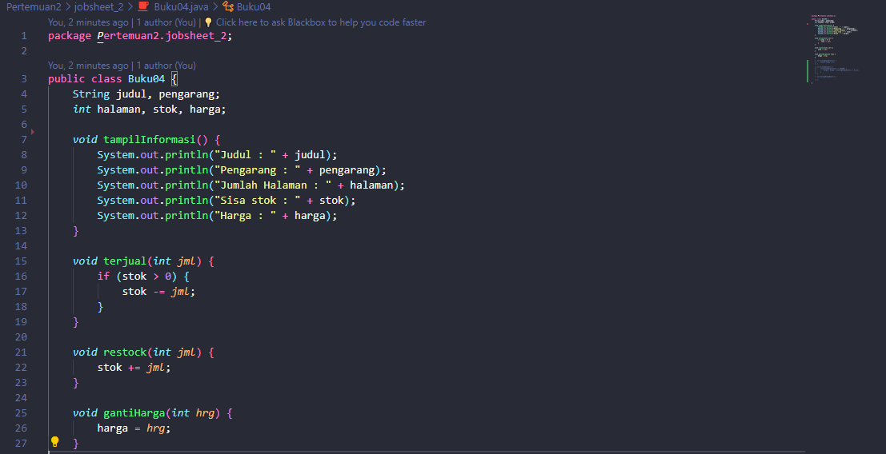
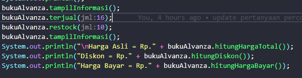

# Laporan Jobsheet 2
#### Nama : Alvanza Saputra Yudha
#### Kelas : 1-H
#### NIM : 2341720182

# 2. Praktikum 

* ## 2.1 Percobaan 1

    Hasil Output : 

    

    ### 2.1.3 Pertanyaan Percobaan 1
1. Sebutkan dua karakteristik class atau object! 
    - Class : 
        - Merupakan sebuah konsep
    
        - Menjelaskan perilaku/status yang didukung oleh objek dari tipenya
    - Object : 
        - memiliki status dan perilaku
    
        - Memiliki Atribut dan behavior
2. Perhatikan class Buku pada Praktikum 1 tersebut, ada berapa atribut yang dimiliki oleh class 
Buku? Sebutkan apa saja atributnya! 
    - Terdapat 5 atribut pada kelas buku, yaitu judul, pengarang, halaman, stok, dan harga.
3. Ada berapa method yang dimiliki oleh class tersebut? Sebutkan apa saja methodnya! 
    - Terdapat 4 method pada kelas buku, yaitu tampilInformasi, terjual, restock, dan gantiHarga.
4. Perhatikan method terjual() yang terdapat di dalam class Buku. Modifikasi isi method tersebut 
sehingga proses pengurangan hanya dapat dilakukan jika stok masih ada (lebih besar dari 0)! 
    - 
5. Menurut Anda, mengapa method restock() mempunyai satu parameter berupa bilangan int?
    - karena fungsi dari method restock adalah untuk menambah stok buku, jadi jika parameternya diisi  dengan angka maka akan menambah stok buku sesuai dengan angka int yang diisi.

* ## 2.2 Percobaan 2

    Hasil Output :

    

    ### 2.2.3 Pertanyaan Percobaan 2

1. Pada class BukuMain, tunjukkan baris kode program yang digunakan untuk proses instansiasi! 
Apa nama object yang dihasilkan? 
    - 
    nama object yang dihasilkan adalah bk1.
2. Bagaimana cara mengakses atribut dan method dari suatu objek? 
    - dengan cara memanggil nama objectnya lalu memanggil atribut atau methodnya. Contoh : 
    
3. Mengapa hasil output pemanggilan method tampilInformasi() pertama dan kedua berbeda? 
    - Karena jumlah stok yang sudah dikurangi dan harga yang sudah dirubah pada pemanggilan method tampilanInformasi() yang kedua.

* ## 2.3 Percobaan 3

    Hasil Output :

    

    ### 2.3.3 Pertanyaan Percobaan 3

1. Pada class Buku di Percobaan 3, tunjukkan baris kode program yang digunakan untuk 
mendeklarasikan konstruktor berparameter!
    - 
2. Perhatikan class BukuMain. Apa sebenarnya yang dilakukan pada baris program berikut?
    - menginstansiasi object bernama bk2.
3. Hapus konstruktor default pada class Buku, kemudian compile dan run program. Bagaimana 
hasilnya? Jelaskan mengapa hasilnya demikian! 
    - Itu karena kompiler Java membuat konstruktor default jika kelas Anda tidak memilikinya. Ada dua aturan yang didefinisikan untuk konstruktor pada Java: Nama konstruktor wajib sama dengan class name atau nama kelasnya. Konstruktor tidak boleh memiliki excplicit return type (tipe pengembalian yang eksplisit)
4. Setelah melakukan instansiasi object, apakah method di dalam class Buku harus diakses secara berurutan? Jelaskan alasannya!
     - Tidak harus mengakses method secara berurutan, Namun, terkadang method harus dipanggil dalam urutan tertentu karena ada ketergantungan. Contohnya : 
        

        Parameter dari method terjual() harus terisi terlebih dahulu supaya method hitungHargaTotal() bisa menghitung nilai dari harga totalnya.
5. Buat object baru dengan nama buku(NamaMahasiswa) menggunakan konstruktor 
berparameter dari class Buku! 

    - instansiasi object bukuAlvanza
    
     

    - Output 

     

* ## 2.4 Latihan Praktikum

    ### No 1

    - Output : 

    

    ### No 2

    - Output : 
    
    
