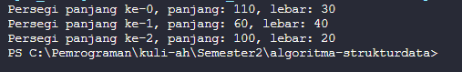
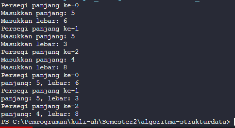
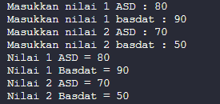
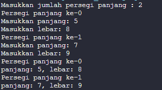
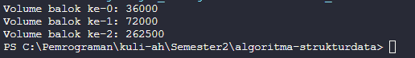
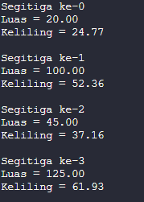
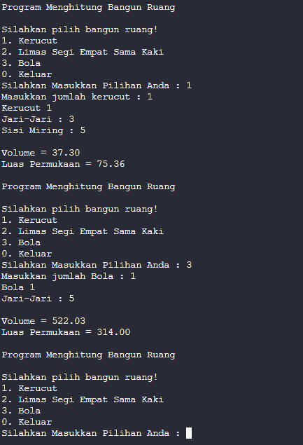
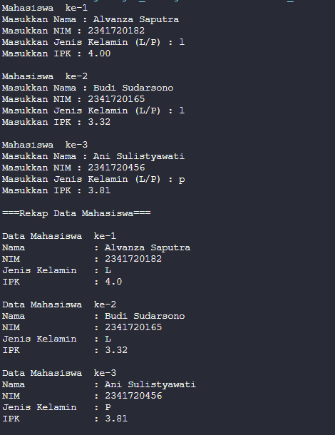
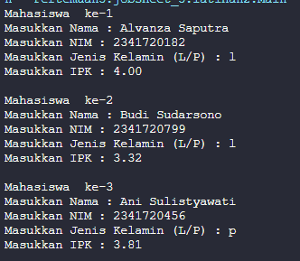
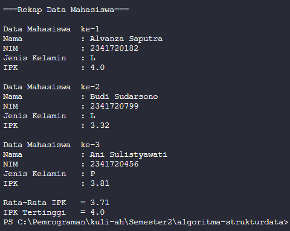

# Laporan Jobsheet 3
#### Nama : Alvanza Saputra Yudha
#### Kelas : 1-H
#### NIM : 2341720182

<hr>

# Praktikum 

* ## 3.2 Percobaan 1

    Hasil Output : 

    

    ### 3.2.3 Pertanyaan Percobaan 1
1. Berdasarkan uji coba 3.2, apakah class yang akan dibuat array of object harus selalu memiliki atribut dan sekaligus method? Jelaskan! 
    - harus memiliki atribut dan method (minimal method main), karena jika tidak ada atribut dan method maka objectnya tidak akan bisa terbentuk

2. Apakah class PersegiPanjang memiliki konstruktor?Jika tidak, kenapa dilakukan pemanggilan 
konstruktur pada baris program berikut : 
    ```java
    ppArray[1] = new persegiPanjang();
    ```
    - class tersebut tidak memiliki konstruktor, pada baris program tersebut bukan merupakan pemanggilan konstruktor, melainkan baris kode tersebut menginstansiasi object pada array object ke-1 di class persegiPanjang.

3. Apa yang dimaksud dengan kode berikut ini:
     ```java
    persegiPanjang[] ppArray = new persegiPanjang[3];
    ```
    - kode berikut adalah proses instansiasi objek dari  array pada class persegiPanjang dengan panjang arraynya yaitu 3.

4. Apa yang dimaksud dengan kode berikut ini: 
    ```java
    ppArray[1] = new persegiPanjang();
    ppArray[1].panjang = 80;
    ppArray[1].lebar = 40;
    ```
    - kode tersebut yang pertama adalah proses instansiasi object dari index ke-1 pada array of object ppArray. Kode berikutnya yaitu mengisi niai dari atribut panjang pada object yang sudah diinstansiasi tadi dengan nilai 80 dan mengisi nilai dari atribut lebar dengan nilai 40.

5. Mengapa class main dan juga class PersegiPanjang dipisahkan pada uji coba 3.2?
    - karena disaat class PersegiPanjang dan main class nya dipisahkan akan membuat sebuah kode program tersebut lebih mudah diatur

* ## 3.3 Percobaan 2

    Hasil Output : 

    

    ### 3.3.3 Pertanyaan Percobaan 2

1. Apakah array of object dapat diimplementasikan pada array 2 Dimensi? 
    - bisa, array of object dapat mengimplementasikan array 2d

2. Jika jawaban soal no satu iya, berikan contohnya! Jika tidak, jelaskan!

    Kode Program : 
    ```java
    import java.util.*;

    public class contoharray2d {
        public int nilaiASD;
        public int nilaiBasdat;

        public static void main(String[] args) {
            Scanner input = new Scanner(System.in);

            contoharray2d[][] nilai = new contoharray2d[2][2];

            for(int i = 0; i < 2; i++) {
                for(int j = 0; j < 2; j++) {
                    nilai[i][j] = new contoharray2d();
                }
            }

            for(int j = 0; j < 2; j++) {
                System.out.print("Masukkan nilai " + (j+1) +  " ASD : ");
                nilai[0][j].nilaiASD = input.nextInt();
                System.out.print("Masukkan nilai " + (j+1) +  " basdat : ");
                nilai[1][j].nilaiBasdat = input.nextInt();
            }

            for(int j = 0; j < 2; j++) {
                System.out.println("Nilai " + (j+1) + " ASD = " + nilai[0][j].nilaiASD);
                System.out.println("Nilai " + (j+1) + " Basdat = " + nilai[1][j].nilaiBasdat);
            }
        }
    }
    ```

    Hasil Output : 

    

3. Jika diketahui terdapat class Persegi yang memiliki atribut sisi bertipe integer, maka kode 
dibawah ini akan memunculkan error saat dijalankan. Mengapa? 
    ```java
    persegi[] pgArray = new persegi[100];
    pgArray[5].sisi = 20;
    ```

    - karena kita harus mengisi index arraynya secara berurutan mulai dari index ke 0 sampai index ke length-1.
 
4. Modifikasi kode program pada praktikum 3.3 agar length array menjadi inputan dengan Scanner! 

    Kode program : 
    ```java
    import java.util.*;

    import java.util.Scanner;

    public class arrayObject {
        public static void main(String[] args) {`
            Scanner sc = new Scanner(System.in);

            System.out.print("Masukkan jumlah persegi panjang : ");
            int jml = sc.nextInt();

            persegiPanjang[] ppArray = new persegiPanjang[jml];

            for(int i = 0; i < jml; i++) {
                ppArray[i] = new persegiPanjang();
                System.out.println("Persegi panjang ke-" + i);
                System.out.print("Masukkan panjang: ");
                ppArray[i].panjang = sc.nextInt();
                System.out.print("Masukkan lebar: ");
                ppArray[i].lebar = sc.nextInt();
            }

            for(int i = 0; i < jml; i++) {
                System.out.println("Persegi panjang ke-" + i);
                System.out.println("panjang: " + ppArray[i].panjang + ", lebar: " + ppArray[i].lebar);
            }
        }
    }       
    ```

    Output : 

    
    
5. Apakah boleh Jika terjadi duplikasi instansiasi array of objek, misalkan saja instansiasi dilakukan 
pada ppArray[i] sekaligus ppArray[0]?Jelaskan !
    - Tidak bisa, karena kedua nilai nya akan menjadi berbeda.


* ## 3.4 Percobaan 3

    Hasil Output : 

    

    ### 3.4.3 Pertanyaan Percobaan 3

1. Dapatkah konstruktor berjumlah lebih dalam satu kelas? Jelaskan dengan contoh! 
    - bisa, tidak terjadi error pada kode karena niai dari yang kita masukkan akan otomatis memilih konstruktor yang mana.
    
        contoh : 
        ```java
        public class balok {
            public String nama;
            public int panjang;
            public int lebar;
            public int tinggi;

            public balok(int p, int l, int t) {
                panjang = p;
                lebar = l;
                tinggi = t;
            }

            public balok(String nama, int p, int l, int t) {
                this.nama = nama;
                panjang = p;
                lebar = l;
                tinggi = t;
            }

            public static void main(String[] args) {
                balok[] biArray = new balok[3];

                biArray[0] = new balok("balok 1",100, 30, 12);
                biArray[1] = new balok(120, 40, 15);
                biArray[2] = new balok(210, 50, 25);
            }
        }
        ```
2. Jika diketahui terdapat class Segitiga seperti berikut ini: 
    ```
    public class Segitiga {
        public int alas;
        public int tinggi;
    }
    ```

    Tambahkan konstruktor pada class Segitiga tersebut yang berisi parameter int a, int t 
    yang masing-masing digunakan untuk mengisikan atribut alas dan tinggi. 

    - ```
        public segitiga(int a, int t) {
            alas = a;
            tinggi = t;
            c = Math.sqrt(Math.pow(a, 2) + Math.pow(t, 2));
        }
        ```
3. Tambahkan method hitungLuas() dan hitungKeliling() pada class Segitiga 
tersebut. Asumsi segitiga adalah segitiga siku-siku. (Hint: Anda dapat menggunakan bantuan 
library Math pada Java untuk mengkalkulasi sisi miring) 
    - ```
        double hitungLuas() {
            return 0.5 * alas * tinggi;
        }

        double hitungKeliling() {
            return alas + tinggi + c;
        }
4. Pada fungsi main, buat array Segitiga sgArray yang berisi 4 elemen, isikan masing-masing 
atributnya sebagai berikut: 

    sgArray ke-0    alas: 10, tinggi: 4 
    sgArray ke-1    alas: 20, tinggi: 10 
    sgArray ke-2    alas: 15, tinggi: 6 
    sgArray ke-3    alas: 25, tinggi: 10 
    
    - ```
        public static void main(String[] args) {
            segitiga[] sgArray = new segitiga[4];

            sgArray[0] = new segitiga(10, 4);
            sgArray[1] = new segitiga(20, 10);
            sgArray[2] = new segitiga(15, 6);
            sgArray[3] = new segitiga(25, 10);
        }
5. Kemudian menggunakan looping, cetak luas dan keliling dengan cara memanggil method 
hitungLuas() dan hitungKeliling(). 
    - ```
        for(int i = 0; i < 4; i++) {
            System.out.println("Segitiga ke-" + i);
            System.out.printf("Luas = %.2f \nKeliling = %.2f\n\n", sgArray[i].hitungLuas(), sgArray[i].hitungKeliling());
        }
        ```
        Output : 

        
    
* ## 3.5 Latihan Praktikum

    ### No 1

    - Output : 

    

    ### No 2

    - Output : 
    
    

    ### No 3

    - Input data Mahasiswa: 
    
    

    - Output rekap data, rata-rata IPK dan IPK tertinggi

    
