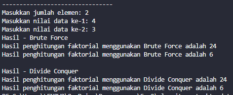

# Laporan Jobsheet 4
#### Nama : Alvanza Saputra Yudha
#### Kelas : 1-H
#### NIM : 2341720182

<hr>

# Praktikum 

* ## 4.2 Menghitung Nilai Faktorial dengan Algoritma Brute Force dan Divide and Conquer

    Hasil Output : 

    

    ### 4.2.3 Pertanyaan Percobaan 1
1. Pada base line Algoritma Divide Conquer untuk melakukan pencarian nilai faktorial, jelaskan perbedaan bagian kode pada penggunaan if dan else!
    - if merupakan base line dari algoritma tersebut karena merupakan batas untuk nilai n yang dimana jika nilai n nya sudah 1 maka akan me-return nilai 1, sedangkan untuk else merupakan program untuk menghitung faktorialnya dengan menggunakan rekursif.
2. Apakah memungkinkan perulangan pada method faktorialBF() dirubah selain menggunakan 
for?Buktikan!
    - memungkinkan menggunakan perulanganm selain for, contohnya menggunakan perulangan while.

    ```java
    int faktorialBF(int n){
        int faktor = 1;
        int i = 1;
        while(i <= n){
            faktor = faktor * i;
            i++;
        }
        return faktor;
    }
    ```

    - Hasil Output : 

    
    
3. Jelaskan perbedaan antara fakto *= i; dan int fakto = n * faktorialDC(n-1); !
    - (fakto *= i;) merupakan teknik iteratif yang digunakan pada metode brute force yang dimana nilai dari faktor yang akan terus dikalikan dengan i yang mengalami looping, sedangkan untuk (int fakto = n * faktorialDC(n-1);) merupakan teknik rekursif yang digunakan pada metode divide & conquer yang dimana nilai n yang akan dikalikan secara otomatis dengan nilai n-1 dari fungsi tersebut.

* ## 4.3 Menghitung Hasil Pangkat dengan Algoritma Brute Force dan Divide and Conquer

    Hasil Output : 

    

    ### 4.3.3 Pertanyaan Percobaan 2
1. Jelaskan mengenai perbedaan 2 method yang dibuat yaitu PangkatBF() dan PangkatDC()!
    - Pada method PangkatBF() menggunakan metode brute force dengan melakukan looping sehingga bilangan pada parameter a akan dikalikan sebanyak n.
    - Pada method PangkatDC() menggunakan metode divide & conquer yang dilakukan dengan rekursif yang terbagi dalam 3 tahap yaitu divide, solve, dan combine.
2. Apakah tahap combine sudah termasuk dalam kode tersebut?Tunjukkan!
    - sudah termasuk, tahap combine pada kode tersebut terdapat pada sintaks *return* dimana hasil dari penyelesaiannya akan di returnkan semua.
3. Modifikasi kode program tersebut, anggap proses pengisian atribut dilakukan dengan 
konstruktor.
    - Membuat method konstruktor default dan konstruktor berparameter pada class Pangkat

    ```java
    Pangkat() {
        
    }

    Pangkat(int n, int p) {
        nilai = n;
        pangkat = p;
    }
    ```

    - Instansiasi dengan konstruktor pada class MainPangkat

    ```java
    png[0] = new Pangkat(3, 3);
    ```
    
4. Tambahkan menu agar salah satu method yang terpilih saja yang akan dijalankan menggunakan 
switch-case!
    - kode Program

    ```java
        System.out.println("Pilih Metode");
        System.out.println("1. Brute Force\n2. Divide & Conquer");
        System.out.print("Masukkan pilihan anda: ");
        int mtd = sc.nextInt();

        switch (mtd) {
            case 1:
                // brute force
                System.out.println("\nHasil Pangkat - Brute Force");
                for(int i = 0; i < elemen; i++) {
                    System.out.println("Hasil Dari " + png[i].nilai + " pangkat " + png[i].pangkat + " adalah " + png[i].pangkatBF(png[i].nilai, png[i].pangkat));
                }
                break;

            case 2:
                // divide conquer
                System.out.println("\nHasil Pangkat - Divide Conquer");
                for(int i = 0; i < elemen; i++) {
                    System.out.println("Hasil Dari " + png[i].nilai + " pangkat " + png[i].pangkat + " adalah " + png[i].pangkatDC(png[i].nilai, png[i].pangkat));
                }
                break;
            default:
                break;
        }
    ```

    - Hasil Output : 

    

* ## 4.4 Menghitung Sum Array dengan Algoritma Brute Force dan Divide and Conquer

    Hasil Output : 

    

    ### 4.4.3 Pertanyaan Percobaan 3
1. Mengapa terdapat formulasi return value berikut?Jelaskan

    `return lsum+rsum+arr[mid]; `

    - sintaks tersebut merupakan tahap combine dimana menggabungkan(menambahkan) lsum, rsum, dan arr[mid] sehingga bisa ditemukan keuntungan dari perusahaan dengan rentang waktu n bulan.

2. Kenapa dibutuhkan variable mid pada method TotalDC()?
    - Karena perhitungan keuntungan pada method totalDC() tersebut membagi bagiannya menjadi left(l), dan right(r). maka dari itu membutuhkan variable mid untuk perhitungan semua bagian tengahnya.

3. Program perhitungan keuntungan suatu perusahaan ini hanya untuk satu perusahaan saja. Bagaimana cara menghitung sekaligus keuntungan beberapa bulan untuk beberapa perusahaan.(Setiap perusahaan bisa saja memiliki jumlah bulan berbeda-beda)? Buktikan 
dengan program!
    - Update class MainSum

    ```java
    public class MainSum {
        public static void main(String[] args) {
            Scanner sc = new Scanner(System.in);   
            
            System.out.println("==========================");
            System.out.println("Program Menghitung Keuntungan Total (Satuan Juta, Misal 5.9)");
            System.out.print("Masukkan jumlah Perusahaan: ");
            int per = sc.nextInt();

            Sum[] sm = new Sum[per];
            
            for(int i = 0; i < per; i++) {
                System.out.print("Masukkan jumlah bulan pada perusahaan ke-" + (i+1) + ": ");
                int bul = sc.nextInt();
                sm[i] = new Sum(bul);
            }
            System.out.println("==========================");
            for(int i = 0; i < per; i++) {
                System.out.println("PERUSAHAAN " + (i + 1));
                for(int j = 0; j < sm[i].elemen; j++) {
                    System.out.print("Masukkan untung bulan ke - " + (j+1) + " = ");
                    sm[i].keuntungan[j] = sc.nextDouble();
                }
            }

            System.out.println("==========================");
            System.out.println("Algoritma Brute Force");
            for(int i = 0; i < per; i++) {
                System.out.println("Total keuntungan perusahaan " + (i+1) + " selama " + sm[i].elemen + " bulan adalah = " + sm[i].totalBF(sm[i].keuntungan) + " Juta");
            }

            System.out.println("==========================");
            System.out.println("Algoritma Divide & Conquer");
            for(int i = 0; i < per; i++) {
                System.out.println("Total keuntungan perusahaan " + (i+1) + " selama " + sm[i].elemen + " bulan adalah = " + sm[i].totalDC(sm[i].keuntungan, 0, sm[i].elemen-1) + " Juta");
            }
            
        }
    }
    ```

    - Hasil Output : 

    

* ## 4.5 Latihan Praktikum
1. Sebuah showroom memiliki daftar mobil dengan data sesuai tabel di bawah ini

    

Tentukan:
-  top_acceleration tertinggi menggunakan Divide and Conquer!
-  top_acceleration terendah menggunakan Divide and Conquer!
-  Rata-rata top_power dari seluruh mobil menggunakan Brute Force!
