# Laporan Jobsheet 5
#### Nama : Alvanza Saputra Yudha
#### Kelas : 1-H
#### NIM : 2341720182

# Praktikum 

* ## 5.2 Mengurutkan Data Mahasiswa Berdasarkan IPK Menggunakan Bubble Sort

    Hasil Output : 

    - Sebelum Bubble Sort

    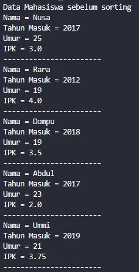

    - Sesudah Bubble Sort

    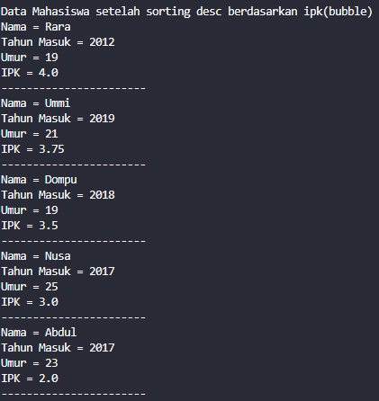

    ### 5.2.3 Pertanyaan Percobaan 1
1. Terdapat di method apakah proses bubble sort?
    - a
2. Di dalam method bubbleSort(), terdapat baris program seperti di bawah ini:

    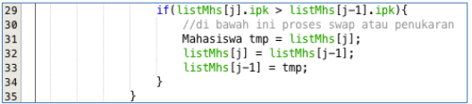

    Untuk apakah proses tersebut?

    - a
3. Perhatikan perulangan di dalam bubbleSort() di bawah ini:

    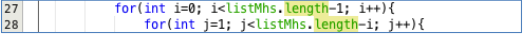

    a. Apakah perbedaan antara kegunaan perulangan i dan perulangan j? 
    - a

    b. Mengapa syarat dari perulangan i adalah i<listMhs.length-1 ?
    - a

    c. Mengapa syarat dari perulangan j adalah j<listMhs.length-i ?
    - a

    d. Jika banyak data di dalam listMhs adalah 50, maka berapakali perulangan i akan 
    berlangsung? Dan ada berapa Tahap bubble sort yang ditempuh?
    - a

* ## 5.3 Mengurutkan Data Mahasiswa Berdasarkan IPK Menggunakan Selection Sort

    Hasil Output : 

    - Sebelum Selection Sort

    

    - Sesudah Selection Sort

    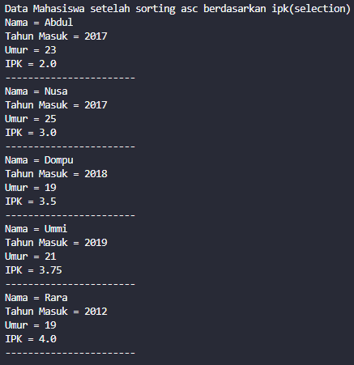

    ### 5.3.3 Pertanyaan Percobaan 2
1. Di dalam method selection sort, terdapat baris program seperti di bawah ini:

    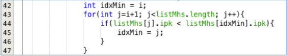

    Untuk apakah proses tersebut, jelaskan!

    - a

* ## 5.4 Mengurutkan Data Mahasiswa Berdasarkan IPK Menggunakan Insertion Sort

    Hasil Output : 

    - Sebelum Selection Sort

    

    - Sesudah Selection Sort

    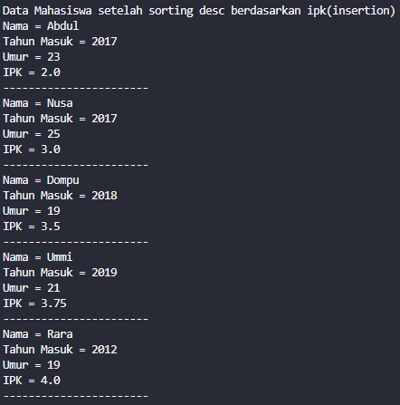

    ### 5.4.3 Pertanyaan Percobaan 3
1. Ubahlah fungsi pada InsertionSort sehingga fungsi ini dapat melaksanakan proses sorting dengan cara descending.
    - a

* ## 5.5 Latihan Praktikum
Sebuah platform travel yang menyediakan layanan pemesanan kebutuhan travelling sedang 
mengembangkan backend untuk sistem pemesanan/reservasi akomodasi (penginapan), salah 
satu fiturnya adalah menampilkan daftar penginapan yang tersedia berdasarkan pilihan filter 
yang diinginkan user. Daftar penginapan ini harus dapat disorting berdasarkan 
1. Harga dimulai dari harga termurah ke harga tertinggi. 
2. Rating bintang penginapan dari bintang tertinggi (5) ke terendah (1) 
Buatlah proses sorting data untuk kedua filter tersebut dengan menggunakan algoritma 
bubble sort dan selection sort.

    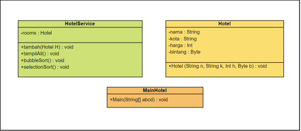

- Tampilan Menu Awal

    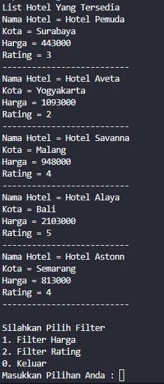

- Tampilan Menu Filter Harga

    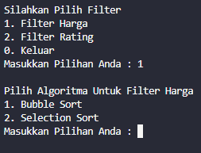

- Tampilan Filter Harga Algoritma Bubble Sort

    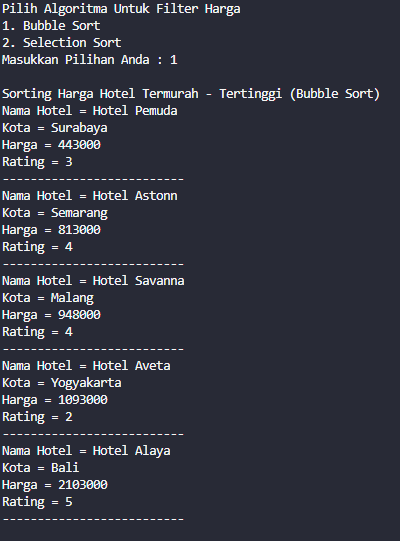

- Tampilan Filter Harga Algoritma Selection Sort

    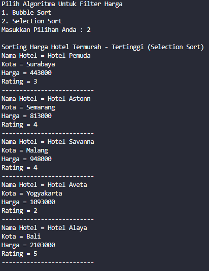

- Tampilan Menu Filter Rating

    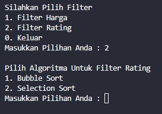

- Tampilan Filter Rating Algoritma Bubble Sort

    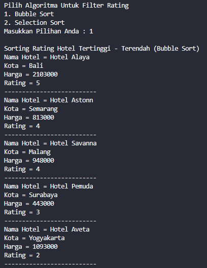

- Tampilan Filter Rating Algoritma Selection Sort

    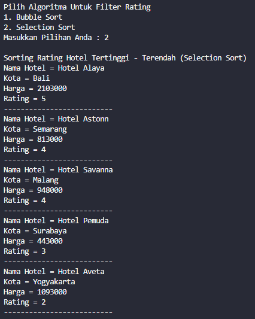

- Tampilan Menu Exit

    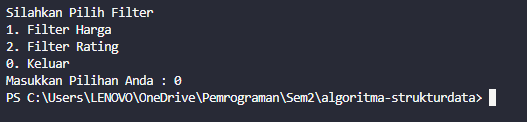