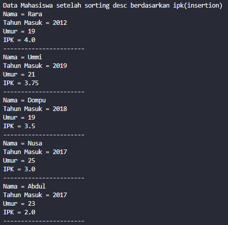

# Laporan Jobsheet 5
#### Nama : Alvanza Saputra Yudha
#### Kelas : 1-H
#### NIM : 2341720182

<hr>

# Praktikum 

* ## 5.2 Mengurutkan Data Mahasiswa Berdasarkan IPK Menggunakan Bubble Sort

    Hasil Output : 

    - Sebelum Bubble Sort

    

    - Sesudah Bubble Sort

    

    ### 5.2.3 Pertanyaan Percobaan 1
1. Terdapat di method apakah proses bubble sort?
    - Terdapat pada method bubblesort() pada class DaftarMahasiswaBerprestasi.

2. Di dalam method bubbleSort(), terdapat baris program seperti di bawah ini:

    

    Untuk apakah proses tersebut?

    - Untuk membandingkan dan menukar nilai ipk dari index j dan j-1, apabila index j nya lebih besar, maka nilainya akan ditukar ke index j-1. 

3. Perhatikan perulangan di dalam bubbleSort() di bawah ini:

    

    a. Apakah perbedaan antara kegunaan perulangan i dan perulangan j? 
    - Perulangan i mengontrol jumlah iterasi pengurutan, sedangkan perulangan j digunakan untuk membandingkan elemen dalam array.

    b. Mengapa syarat dari perulangan i adalah i<listMhs.length-1 ?
    - Supaya perulangan sesuai dengan jumlah index yang ada pada Array Object listMhs. Hal ini memastikan bahwa semua yang ada dalam array object tersebut dapat dibandingkan nilainya

    c. Mengapa syarat dari perulangan j adalah j<listMhs.length-i ?
    - untuk mencegah perbandingan elemen yang tidak ada dan memastikan semua elemen dibandingkan nilainya

    d. Jika banyak data di dalam listMhs adalah 50, maka berapakali perulangan i akan 
    berlangsung? Dan ada berapa Tahap bubble sort yang ditempuh?
    - Perulangan i akan berlangsung sebanyak 49x dan tahap yang ditempuhnya tidak dapat dipastikan secara langsung, karena jika data sudah secara kebetulan terurut maka hanya membutuhkan 1 tahap, dan jika data benar-benar acak, maka akan membutuhkan n-1 tahap dimana n merupakan jumlah data yang dalam konteks ini terdapat 49 tahap jika datanya benar-benar teracak.

* ## 5.3 Mengurutkan Data Mahasiswa Berdasarkan IPK Menggunakan Selection Sort

    Hasil Output : 

    - Sebelum Selection Sort

    

    - Sesudah Selection Sort

    

    ### 5.3.3 Pertanyaan Percobaan 2
1. Di dalam method selection sort, terdapat baris program seperti di bawah ini:

    

    Untuk apakah proses tersebut, jelaskan!

    - Untuk membandingkan nilai pada index ke i dan index ke i+1, jika index i+1 lebih kecil daripada i, maka indexnya akan ditukar melalui variabel idxMin. 

* ## 5.4 Mengurutkan Data Mahasiswa Berdasarkan IPK Menggunakan Insertion Sort

    Hasil Output : 

    - Sebelum Selection Sort

    

    - Sesudah Selection Sort

    

    ### 5.4.3 Pertanyaan Percobaan 3
1. Ubahlah fungsi pada InsertionSort sehingga fungsi ini dapat melaksanakan proses sorting dengan cara descending.
    - Method Insertion Sort

    ```java
   void insertionSort() {
        for(int i = 1; i < listMhs.length; i++) {
            Mahasiswa tmp = listMhs[i];
            int j = i;
            while(j > 0 && listMhs[j - 1].ipk < tmp.ipk) {
                listMhs[j] = listMhs[j-1];
                j--;
            }
            listMhs[j] = tmp;
        }
    }
    ```

    - Hasil Output :

    


* ## 5.5 Latihan Praktikum
Sebuah platform travel yang menyediakan layanan pemesanan kebutuhan travelling sedang 
mengembangkan backend untuk sistem pemesanan/reservasi akomodasi (penginapan), salah 
satu fiturnya adalah menampilkan daftar penginapan yang tersedia berdasarkan pilihan filter 
yang diinginkan user. Daftar penginapan ini harus dapat disorting berdasarkan 
1. Harga dimulai dari harga termurah ke harga tertinggi. 
2. Rating bintang penginapan dari bintang tertinggi (5) ke terendah (1) 
Buatlah proses sorting data untuk kedua filter tersebut dengan menggunakan algoritma 
bubble sort dan selection sort.

    

- Tampilan Menu Awal

    

- Tampilan Menu Filter Harga

    

- Tampilan Filter Harga Algoritma Bubble Sort

    

- Tampilan Filter Harga Algoritma Selection Sort

    

- Tampilan Menu Filter Rating

    

- Tampilan Filter Rating Algoritma Bubble Sort

    

- Tampilan Filter Rating Algoritma Selection Sort

    

- Tampilan Menu Exit

    