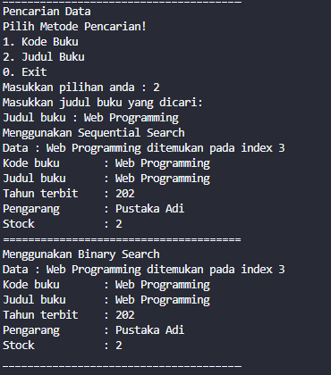

# Laporan Jobsheet 6
#### Nama : Alvanza Saputra Yudha
#### Kelas : 1-H
#### NIM : 2341720182

<hr>

# Praktikum 

* ## 6.2 Searching / Pencarian Menggunakan Agoritma Sequential Search

    Input data buku : 

    

    Output data keseluruhan buku :

    

    Output Sequential Search (tanpa keterangan data) :

    

    Output Sequential Search data ditemukan (dengan keterangan data)

    

    Output Sequential Search data tidak ditemukan

    
    
    ### 6.2.3. Pertanyaan Percobaan 1
1. Jelaskan fungsi break yang ada pada method FindSeqSearch!
    - Untuk menghentikan perulangan jika posisi index dari kode buku yang dicari sudah ditemukan.

2. Jika Data Kode Buku yang dimasukkan tidak terurut dari kecil ke besar. Apakah program masih dapat berjalan? Apakah hasil yang dikeluarkan benar? Tunjukkan hasil screenshoot untuk bukti dengan kode Buku yang acak. Jelaskan Mengapa hal tersebut bisa terjadi?
    - Program masih dapat berjalan dengan baik dan benar. berikut contoh dengan kode buku acak

    Input data buku (acak) :

    

    Output data keseluruhan buku (acak) :

    

    Output Sequential Search : 

    

    - Dapat terlihat bahwa data buku masih bisa ditemukan meskipun datanya sudah diacak, hal itu dikarenakan proses dari sequential search membandingkan elemen array satu per satu secara beruntun mulai dari elemen pertama sampai elemen yang dicari sudah ditemukan atau sampai semua elemen sudah diperiksa. Jadi meskipun datanya acak, prosesnya tidak akan error

3. Buat method baru dengan nama FindBuku menggunakan konsep sequential search dengan tipe method dari FindBuku adalah BukuNoAbsen. Sehingga Anda bisa memanggil method 
tersebut pada class BukuMain seperti gambar berikut :

    

    - Kode Program pada class PencarianBuku :

    ```java
    public Buku04 findBuku(int cari) {
        int posisi = -1;
        for(int j = 0; j < listBk.length; j++) {
            if(listBk[j].kodeBuku == cari) {
                posisi = j;
                break;
            }
        }
        return listBk[posisi];
    }
    ```

    - Hasil Output

    


* ## 6.3 Searching / Pencarian Menggunakan Binary Search

    Input data buku : 

    

    Output data keseluruhan buku : 

    

    Output Hasil Binary Search : 

    

    ### 6.3.3. Pertanyaan Percobaan 1
1. Tunjukkan pada kode program yang mana proses divide dijalankan!
    - Proses divide terjadi pada kode program berikut

        ``
        mid = (left + right) / 2;
        ``

2. Tunjukkan pada kode program yang mana proses conquer dijalankan!
    - Proses conquer terjadi pada kode program berikut yang dimana tahap conquer terjadi saat nilai yang dicari sudah ditemukan dan fungsi me-return nilai dari variabel mid
        ```java
        if(cari == listBk[mid].kodeBuku) {
            return mid;
        }
        ```

3. Jika data Kode Buku yang dimasukkan tidak urut. Apakah program masih dapat berjalan? Mengapa demikian! Tunjukkan hasil screenshoot untuk bukti dengan kode Buku yang acak. Jelaskan 
Mengapa hal tersebut bisa terjadi? 
    - Program masih bisa berjalan tetapi tidak sesuai dengan yang diinginkan

    Input data buku (acak) :

    

    Output data keseluruhan buku (acak) :

    

    Output Binary Search : 

    

    - Data searching menggunakan proses Binary Search tidak muncul, hal tersebut dikarenakan pada algoritma Binary Search Teknik pencarian = data dibagi menjadi dua bagian untuk setiap kali proses pencarian. Data awal harus dalam kondisi terurut. Sehingga harus dilakukan proses sorting terlebih dahulu untuk data awal.

4. Jika Kode Buku yang dimasukkan dari Kode Buku terbesar ke terkecil (missal : 20215, 20214, 20212, 20211, 20210) dan elemen yang dicari adalah 20210. Bagaimana hasil dari binary search Apakah sesuai? Jika tidak sesuai maka ubahlah kode program binary seach agar hasilnya sesuai!
    - Hasilnya tidak sesuai

    Input data secara descending :

    

    Output Binary Search : 

    

    - Jadi agar kode tersebut bisa berhasil jika datanya descending, maka berikut adalah kode program yang harus diubah pada method findBinarySearch()

        ``
        else if(listBk[mid].kodeBuku < cari)
        ``

    Hasil Output :

    


* ## 6.4 Percobaan Pengayaan Divide and Conquer

    Method mergeSort() :

    ```java
    public void mergeSort(int[] data) { 
        sort(data, 0, data.length-1);
    }
    ```

    Hasil Output : 

    

* ## 6.5 Latihan Praktikum

1. Modifikasi percobaan searching diatas dengan ketentuan berikut ini
- Ubah tipe data dari kode Buku yang awalnya int menjadi String
- Tambahkan method untuk pencarian kode Buku (bertipe data String) dengan menggunakan 
sequential search dan binary search.
    - Mengubah tipe data kode buku menjadi String

    

    - Method sequential search dengan String :

    

    - Pemanggilan Method sequential pada class BukuMain :

    

    - Method binary search dengan String : 

    

    - Pemanggilan Method binary pada class BukuMain :

    

    - Input nilai buku :

    

    - Output data keseluruhan buku : 

    

    - Output pencarian ditemukan

    

    - Output pencarian tidak ditemukan

    

2. Modifikasi percobaan searching diatas dengan ketentuan berikut ini
- Tambahkan method pencarian judul buku menggunakan sequential search dan binary 
search. Sebelum dilakukan searching dengan binary search data harus dilakukan pengurutan 
dengan menggunakan algoritma Sorting (bebas pilih algoritma sorting apapun)! Sehingga 
ketika input data acak, maka algoritma searching akan tetap berjalan
- Buat aturan untuk mendeteksi hasil pencarian judul buku yang lebih dari 1 hasil dalam 
bentuk kalimat peringatan! Pastikan algoritma yang diterapkan sesuai dengan kasus yang 
diberikan!

    - Method sorting :

    

    - Method pencarian judul buku sequential search : 

    

    - Class main pencarian judul buku sequential search : 

    

    - Method pencarian judul buku binary search : 

    

    - Class main pencarian judul buku binary search : 

    

    - Input data buku : 

    

    - Data Keseluruhan buku (Sebelum Sorting) : 

    

    - Data Keseluruhan buku (Setelah Sorting) : 

    

    - Hasil Pencarian :

    
