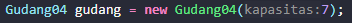

# Laporan Jobsheet 7
#### Nama : Alvanza Saputra Yudha
#### Kelas : 1-H
#### NIM : 2341720182

<hr>

# Praktikum 

* ## 2.1 Percobaan 1: Penyimpanan Tumpukan Barang dalam Gudang

    Verifikasi Hasil Percobaan

    Tambah & Ambil Barang :

    

    Input & Menampilkan tumpukan :

    

    ### 2.1.3 Pertanyaan
1. Lakukan perbaikan pada kode program, sehingga keluaran yang dihasilkan sama dengan verifikasi hasil percobaan! Bagian mana saja yang perlu diperbaiki?
    - Bagian yang perlu diperbaiki :

        

    - Bagian tersebut setelah diperbaiki :

        

2. Berapa banyak data barang yang dapat ditampung di dalam tumpukan? Tunjukkan potongan kode programnya!
    - Banyaknya data yang dapat ditampung adalah 7 data

        

3. Mengapa perlu pengecekan kondisi !cekKosong() pada method tampilkanBarang? Kalau kondisi tersebut dihapus, apa dampaknya?
    - Diperlukan pengecekan kondisi tersebut untuk mengecek apakah terdapat barang di gudang atau tidak. Jika kondisi tersebut dihapus maka jika gudang tidak terdapat barang, maka method tersebut tidak akan menampilkan apa-apa. Sebaliknya, jika dilakukan pengecekan kondisi terlebih dahulu, maka kita bisa menentukan output yang akan muncul jika barang yang ada di gudang kosong.

4. Modifikasi kode program pada class Utama sehingga pengguna juga dapat memilih operasi lihat barang teratas, serta dapat secara bebas menentukan kapasitas gudang!
    - Penambahan Kode : 
        ```java
        System.out.print("Input kapasitas Gudang : ");
        int kap = scanner.nextInt();
        scanner.nextLine();

        Gudang04 gudang = new Gudang04(kap);
        ```

        ```java
        case 4:
            gudang.lihatBarangTop();
        break;
        ```

5. Commit dan push kode program ke Github
    - 


* ## 2.2 Percobaan 2: Konversi Kode Barang ke Biner

    Verifikasi hasil percobaan :

    

    ### 2.2.3 Pertanyaan
1. Pada method konversiDesimalKeBiner, ubah kondisi perulangan menjadi while (kode != 0), bagaimana hasilnya? Jelaskan alasannya!
    - Hasilnya tetap dan program masih dapat berjalan. Hal tersebut karena nilai dari kode (kode dari barang yang dihapus) harusnya nilainya min(-), jadi jika memakai kode > 0, maka output dari kode uniknya null(kosong), dan jika memakai kode kode != 0, maka output dari kode uniknya bernilai min(-)

2. Jelaskan alur kerja dari method konversiDesimalKeBiner!
    - Nilai yang dimasukkan dari parameter akan dicek apakah nilainya > 0 atau tidak, jika nilai > 0 maka akan melakukan perulangan. Selanjutnya nilai tersebut akan di modulo dengan 2 dan dimasukkan ke dalam variabel sisa, lalu nilainya akan di push pada method push di object stack. setelah iku nilainya akan dibagi dengan dua dan perulangan kembali dilakukan sampai nilainya 0 (jika nilainya 0 perulangan berhanti). setelah itu program mengecek apakah stack di object stack kosong atau tidak, jika ada isinya maka tumpukan biner teratas akan dimasukkan pada variabel biner dan program akan me-return nilai dari variabel biner tersebut.


* ## 2.3 Percobaan 3: Konversi Notasi Infix ke Postfix

    Verifikasi hasil percobaan :

    

    ### 2.2.3 Pertanyaan
1. Pada method derajat, mengapa return value beberapa case bernilai sama? Apabila return 
value diubah dengan nilai berbeda-beda setiap case-nya, apa yang terjadi?
    - Beberapa case memiliki return value yang sama karena kedudukannya prioritasnya yang setara seperti * dan / (setara). Jika return valuenya diubah dengan nilai berbeda-beda maka kedudukan dari setiap operator akan berbeda-beda yang dimana akan menimbulkan error dalam konversi postfixnya

2. Jelaskan alur kerja method konversi!
    - Variabel P digunakan untuk menyimpan hasil dari stack yang sudah diproses di variabel c. Program melakukan perulangan sebanyak n (panjang dari String Q). char ke i pada String Q akan dimasukkan ke variabel c untuk diproses. dan prosesnya sebagai berikut :

        a. Jika adalah operand, maka langsung ditambahkan ke variabel P
    
        b.  Jika c adalah '(', maka ditambahkan ke stack menggunakan method push().

        c. jika c adalah ')', maka semua karakter pada stack ditambahkan pada variabel P sampai '(' ditemukan dan '(' kemudian dihapus dari stack dengan method pop().

        d. jika c adalah operator, maka char operator pada stack dengan kedudukan prioritas yang lebih tinggi ditambah di variabel P sampai char operator yang lebih rendah atau sama ditemukan dan operator tersebut kemudian ditambahkan menggunakan method push().

        Setelah semua iterasi selesai, method mereturn nilai pada variabel P 

3. Pada method konversi, apa fungsi dari potongan kode berikut?

    

    - Memasukkan char ke i pada String Q ke dalam variabel c (i sesuai dengan iterasinya dalam perulangan).


* ## 2.4 Latihan Praktikum
Perhatikan dan gunakan kembali kode program pada Percobaan 1. Tambahkan dua method berikut 
pada class Gudang:

• Method lihatBarangTerbawah digunakan untuk mengecek barang pada tumpukan terbawah

• Method cariBarang digunakan untuk mencari ada atau tidaknya barang berdasarkan kode
barangnya atau nama barangnya

- Method lihatBarangTerbawah()

    ```java
    public Barang04 lihatBarangTerbawah() {
        if(!cekKosong()) {
            System.out.println("Barang terbawah : " + tumpukan[0].nama);
            return tumpukan[0];
        } else {
            System.out.println("Tumpukan barang kosong");
            return null;
        }
    }
    ```

- Output Lihat Barang Terbawah

    

- Method Cari Barang (dengan kode barang)

    ```java
    public boolean cariKodeBarang(int cari) {
        for(int i = 0; i < tumpukan.length; i++) {
            if(tumpukan[i].kode == cari) {
                return true;
            }
        }
        return false;
    }
    ```

- Method Cari Barang (dengan nama barang)

    ```java
    public boolean cariNamaBarang(String cari) {
        for(int i = 0; i < tumpukan.length; i++) {
            if(tumpukan[i].nama.equalsIgnoreCase(cari)) {
                return true;
            }
        }
        return false;
    }
    ```

- Method Utama 

    ```java
     case 1:
        System.out.print("Masukkan kode barang yang anda cari : ");
        int cari = scanner.nextInt();
        gudang.cariKodeBarang(cari);
        if (gudang.cariKodeBarang(cari) == true) {
            System.out.println("Barang yang anda cari ada di dalam gudang");
        } else {
            System.out.println("Barang yang anda cari tidak ada di dalam gudang");	
        }
        break;

    case 2:
        System.out.print("Masukkan nama barang yang anda cari : ");
        String cariNama = scanner.nextLine();
        gudang.cariNamaBarang(cariNama);
        if (gudang.cariNamaBarang(cariNama) == true) {
            System.out.println("Barang yang anda cari ada di dalam gudang");
        } else {
            System.out.println("Barang yang anda cari tidak ada di dalam gudang");	
        }
    ```

- Output Cari Barang

    