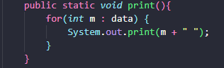
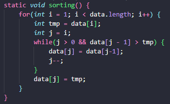
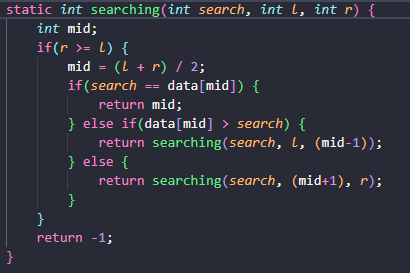
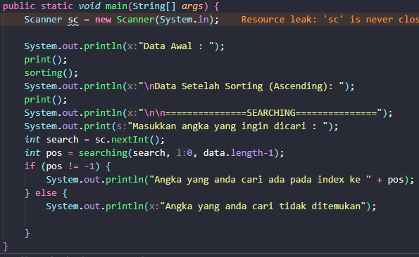
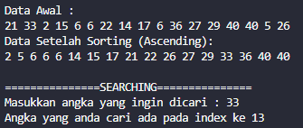

# UTS Algoritma & Struktur Data
#### Nama : Alvanza Saputra Yudha
#### Kelas : 1-H
#### NIM : 2341720182

- Instansiasi dan Inisialisasi array untuk data

    

- Method untuk menampilkan seluruh data

    

- Method untuk mengurutkan data secara ascending (sorting)

    

- Method untuk mencari data (searching)

    

- Method Main

    

- Hasil Output

    

